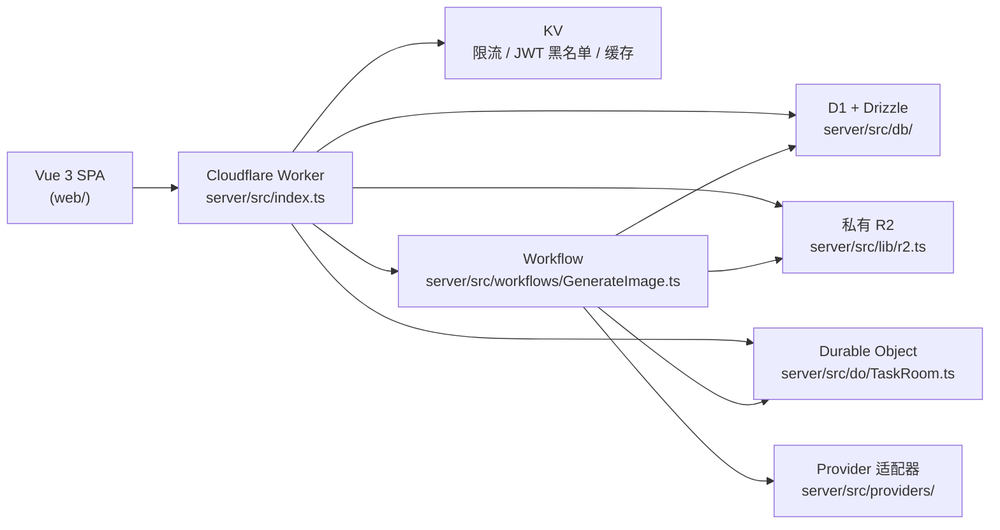

# Edge Muse Platform — 架构说明

本文描述仓库内**真实代码布局**与运行时形态；细节惯例见 [`docs/DESIGN.md`](docs/DESIGN.md)。

## 系统概览

## Monorepo 布局

| 路径                              | 职责                                                                   |
| --------------------------------- | ---------------------------------------------------------------------- |
| [`server/`](server/)              | Cloudflare Worker：Hono API、WebSocket、D1/R2、Workflows、DO           |
| [`web/`](web/)                    | Vite + Vue 3 SPA：工作台、历史、管理端、系统管理                       |
| 根 [`package.json`](package.json) | `pnpm` workspace 脚本：`dev` / `build` / `lint` / `typecheck` / `test` |

## 运行时形态

- **单一 Worker** 同时提供：`/api/*` REST、任务 WebSocket（见 [`server/src/index.ts`](server/src/index.ts) 注释）、以及构建后的 SPA（Workers Static Assets）。
- **D1** 存用户、配额、会话、消息、任务、服务商元数据、密钥密文、审计等（[`server/src/db/schema.ts`](server/src/db/schema.ts)）。
- **R2** 私有；图片仅通过鉴权后的 [`server/src/routes/images.ts`](server/src/routes/images.ts) 等路径读出。
- **Durable Objects**（`TaskRoom`）按任务维护 WebSocket 房间与最新任务状态。
- **Workflow** `GenerateImage` 承载长耗时生图路径并回写 D1/R2。

## Provider 与多服务商

- `providers.request_format` 决定适配器：[`server/src/providers/registry.ts`](server/src/providers/registry.ts)。
- **`openai_compatible`**：米醋 API 等 Responses/兼容路径（[`server/src/providers/openai-compatible.ts`](server/src/providers/openai-compatible.ts)）。
- **`openai_images`**：OpenAI Images 形态，用于 Cubence 等（[`server/src/providers/openai-images.ts`](server/src/providers/openai-images.ts)）——文生图 `/v1/images/generations`，图生图 multipart `/v1/images/edits`。
- **内置服务商目录**：[`server/src/providers/catalog.ts`](server/src/providers/catalog.ts) 自动补齐/恢复「米醋API」与 Cubence 元数据；独立「服务商管理页」已移除，密钥在系统管理 → 密钥中创建。
- **密钥解析**：[`server/src/lib/providerKeys.ts`](server/src/lib/providerKeys.ts)——用户须具备**明确**偏好密钥或 `user_provider_keys` 绑定；**无**「全局最新 key」兜底。

## 生图任务管线（模块化）

[`server/src/lib/tasks.ts`](server/src/lib/tasks.ts) 为对外稳定导出面；实现按目录拆分在 [`server/src/lib/tasks/`](server/src/lib/tasks/)（`create`、`dispatch`、`run`、`recovery`、`failure` 等）。路由、Workflow、DO 仅需依赖 `tasks.ts`，不需关心子路径。

## 生成入口与行为事件

- **持久化**：D1 表 `generation_entry_settings`（单行 `key=default`）、`generation_events`（漏斗与任务关联事件，见 [`docs/DATABASE.md`](docs/DATABASE.md)）。
- **领域逻辑**：[`server/src/lib/generationEntry.ts`](server/src/lib/generationEntry.ts) — 普通用户可见入口开关、`navTarget`、客户端/服务端事件写入、按路由聚合的最近用量指标（默认 30 天窗口）。
- **用户侧**：[`GET /api/me`](server/src/routes/me.ts) 与登录响应携带 `generationEntry`（`showWorkspace` / `showAiImage` / `navTarget`）；[`POST /api/generation/events`](server/src/routes/generationEvents.ts) 采集允许白名单内的客户端事件；[`POST /api/generate`](server/src/routes/generate.ts) 可附 `generationEvent` 以归因路由与案例。
- **系统管理**：[`GET/PATCH /api/sysadmin/generation-entry`](server/src/routes/sysadmin/generationEntry.ts) 配置入口开关并返回按页统计；**不**再做流量百分比 A/B 分配。

详见 [`docs/EXPERIMENTS.md`](docs/EXPERIMENTS.md)（文件名沿用历史链接；内容描述当前「生成入口」模型）。

## 请求与数据流（摘要）

1. 浏览器调用 `POST /api/generate`（[`server/src/routes/generate.ts`](server/src/routes/generate.ts)）→ 创建任务、预扣配额、返回 `taskId` / WebSocket URL。
2. Workflow 或 `waitUntil` 执行 [`server/src/lib/tasks.ts`](server/src/lib/tasks.ts) 导出的生成管线（实现见 `lib/tasks/*`）→ 调 provider → 图片入 R2 → 更新消息附件。
3. 任务事件经 DO 广播，前端 [`web/src/composables/useTaskWebSocket.ts`](web/src/composables/useTaskWebSocket.ts) / [`web/src/stores/session.ts`](web/src/stores/session.ts) 合并状态。

## 横切关注点

| 主题                | 实现位置                                                                                                                                                                               |
| ------------------- | -------------------------------------------------------------------------------------------------------------------------------------------------------------------------------------- |
| 认证 / JWT / Cookie | [`server/src/middleware/auth.ts`](server/src/middleware/auth.ts)、[`server/src/lib/jwt.ts`](server/src/lib/jwt.ts)、[`server/src/lib/cookies.ts`](server/src/lib/cookies.ts)           |
| CSRF                | [`server/src/middleware/csrf.ts`](server/src/middleware/csrf.ts)                                                                                                                       |
| 安全响应头          | [`server/src/middleware/security.ts`](server/src/middleware/security.ts)                                                                                                               |
| 限流                | [`server/src/middleware/rateLimit.ts`](server/src/middleware/rateLimit.ts)                                                                                                             |
| 错误体格式          | [`server/src/middleware/error.ts`](server/src/middleware/error.ts)、[`server/src/lib/errors.ts`](server/src/lib/errors.ts)                                                             |
| 审计                | [`server/src/lib/audit.ts`](server/src/lib/audit.ts)                                                                                                                                   |
| 定时任务            | `scheduled` in [`server/src/index.ts`](server/src/index.ts) → [`server/src/lib/operations.ts`](server/src/lib/operations.ts)、[`server/src/lib/cleanup.ts`](server/src/lib/cleanup.ts) |

## 相关文档

- [`docs/API.md`](docs/API.md) — HTTP 路由清单
- [`docs/DATABASE.md`](docs/DATABASE.md) — D1 表与迁移
- [`docs/FRONTEND.md`](docs/FRONTEND.md) — 前端结构
- [`docs/SECURITY.md`](docs/SECURITY.md) — 安全模型
- [`docs/OPERATIONS.md`](docs/OPERATIONS.md) — 运维与排障
- [`docs/EXPERIMENTS.md`](docs/EXPERIMENTS.md) — 生成实验与事件
- [`AGENTS.md`](AGENTS.md) — 文档地图（给 AI 助手）
