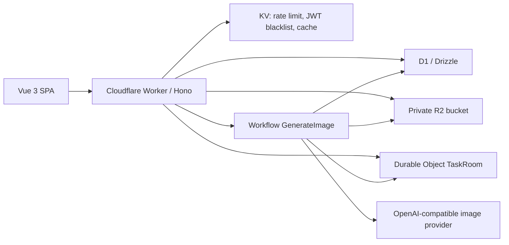

# Edge Muse Platform Architecture

## Runtime Shape

- One Worker serves API, WebSocket upgrade routes, and the built SPA through Workers Static Assets.
- D1 stores users, quotas, sessions, messages, tasks, provider config, image metadata, and audit logs.
- R2 is private. Images are only returned through `/api/i/:imageId` after cookie/JWT authorization.
- Durable Objects keep per-task websocket rooms and latest task state.
- Workflows run the long image generation path and persist results.

## Local Development

The default seed provider uses `base_url = "mock:"`; it returns deterministic SVG images so the platform can be tested without a paid image API key.
