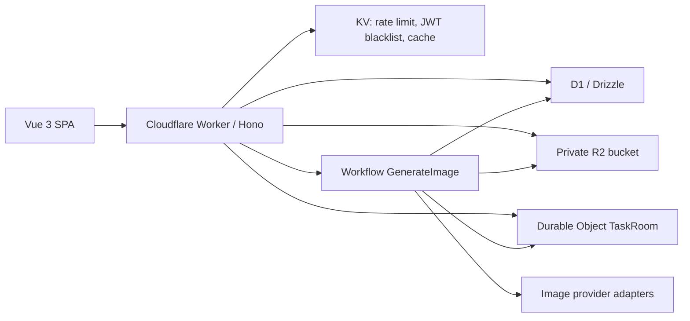

# Edge Muse Platform Architecture

## Runtime Shape

- One Worker serves API, WebSocket upgrade routes, and the built SPA through Workers Static Assets.
- D1 stores users, quotas, sessions, messages, tasks, provider config, image metadata, and audit logs.
- R2 is private. Images are only returned through `/api/i/:imageId` after cookie/JWT authorization.
- Durable Objects keep per-task websocket rooms and latest task state.
- Workflows run the long image generation path and persist results.
- Provider routing uses `providers.request_format`. `openai_compatible` keeps the 米醋API / Responses-compatible path, while `openai_images` is used by Cubence and calls `/v1/images/generations` or `/v1/images/edits`.
- The standalone provider management page has been removed from the SPA. Provider rows remain as internal configuration; built-in 米醋API and Cubence metadata are inserted automatically, restored if soft-deleted, and protected from provider deletion.
- Generation key resolution is explicit: user preferred key first, then `user_provider_keys`; there is no global newest-key fallback. This keeps Cubence rollout tied to deliberate key assignment.

## Local Development

The default seed provider uses `base_url = "mock:"`; it returns deterministic SVG images so the platform can be tested without a paid image API key. 米醋API and Cubence appear as built-in providers in sysadmin key management, but they still require real provider API keys before use.
