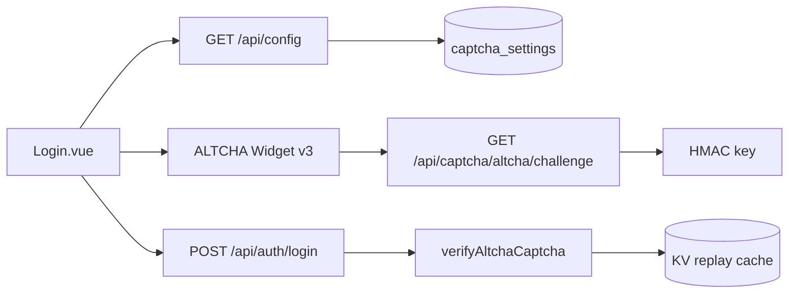
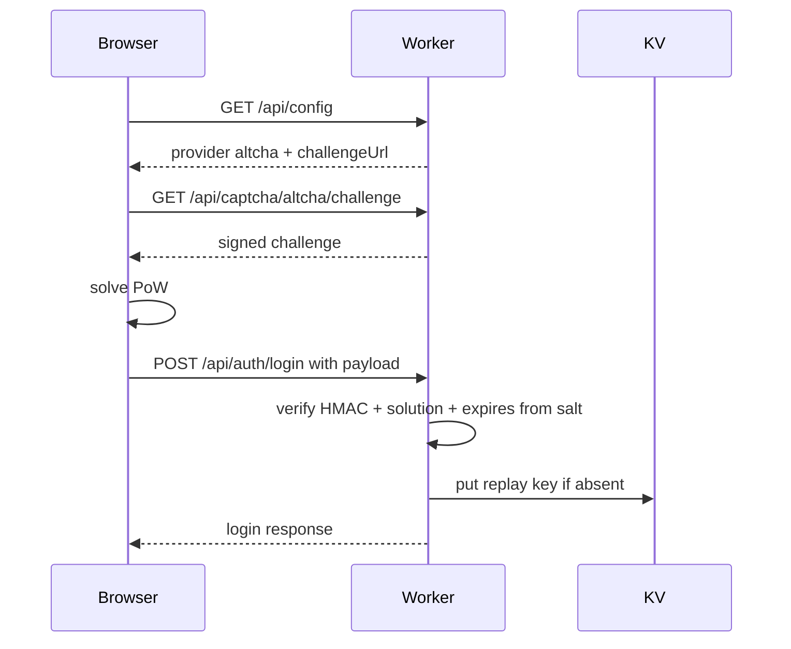

# 需求文档 — ALTCHA 开源验证码 Provider

**版本**: v0.1
**日期**: 2026-05-12
**作者**: 用户 + AI
**状态**: 已确认
**关联任务列表**: [`tasks.md`](./tasks.md)

---

## 1. 背景

Edge Muse Platform 当前登录验证码支持 Cloudflare Turnstile、腾讯云验证码和 disabled，并允许 sysadmin 按国内/国外访问配置 provider。国内链路依赖腾讯云，海外链路依赖 Turnstile；这两类方案都依赖外部平台配置与可用性。

本期要引入一个仍在维护、业界可接受、可自托管的开源验证码 provider。运行环境是 Cloudflare Workers，CPU 预算有限，因此方案需要避免服务端生成图片、复杂 ML/行为分析或高成本服务端求解。调研后选用 ALTCHA Widget v3 + `SHA-256` PoW challenge：浏览器端做 proof-of-work，Worker 只负责签发 challenge、校验 HMAC/solution 和 KV 防重放。

### 1.1 开源项目调研

| 项目                                                                                            | 开源/维护                                         | 特点                                                                                        | Cloudflare Worker 适配判断                                                                                |
| ----------------------------------------------------------------------------------------------- | ------------------------------------------------- | ------------------------------------------------------------------------------------------- | --------------------------------------------------------------------------------------------------------- |
| [ALTCHA](https://github.com/altcha-org/altcha) / [Docs](https://altcha.org/docs/v2/)            | MIT；Widget v3 已发布，官方文档近期更新           | 自托管、隐私优先、PoW、无第三方请求；v3 widget 支持 `SHA-256`、PBKDF2、Argon2/Scrypt 等形态 | 最适合。使用 `SHA-256` challenge 时 Worker 只做常数次 HMAC/SHA-256 + KV，PoW 循环在浏览器                 |
| [Cap](https://capjs.js.org/) / [GitHub](https://github.com/tiagozip/cap)                        | Apache 2.0；社区热度高，仍在活跃维护              | 轻量 widget、PoW + instrumentation，可 standalone 部署并带 dashboard                        | 可选但更像独立 CAPTCHA 服务；若完整使用 dashboard/standalone 会增加部署面，直接嵌入 Worker 需额外适配协议 |
| [mCaptcha](https://github.com/mCaptcha) / [Browser docs](https://mcaptcha.org/docs/api/browser) | 开源 PoW 生态；浏览器文档较旧                     | PoW CAPTCHA，含 WASM/JS 浏览器库与服务端组件                                                | 服务端形态更重，维护节奏和前端集成现代化程度弱于 ALTCHA/Cap，不优先                                       |
| [Friendly Pow](https://github.com/FriendlyCaptcha/friendly-pow)                                 | Friendly Captcha 的 PoW 库，source-available only | PoW 算法库成熟，SaaS 生态完整                                                               | 不是完整开源自托管 provider，且许可不符合“开源 provider”优先级                                            |

**选择结论**: 选 ALTCHA Widget v3。原因不是它“最强风控”，而是它在本项目约束下最平衡：无需额外容器/服务，Widget 维护活跃，协议足够简单，Worker 端不会承担 PoW 循环 CPU；同时保留 Tencent/Turnstile 作为更强托管风控选项。

---

## 2. 目标

### 2.1 范围内

- ✅ 新增验证码 provider `altcha`，可在国内/国外 provider 配置中选择。
- ✅ 使用 ALTCHA Widget v3 接入登录页，挑战从 Worker 自托管接口获取。
- ✅ sysadmin 可配置 ALTCHA challenge 难度。
- ✅ Worker 端生成、签名并校验 ALTCHA challenge，使用 KV 做防重放。
- ✅ 文档、类型、迁移、测试覆盖 provider 配置、challenge 生成与登录验证。

### 2.2 范围外

- ❌ 不做图片验证码、行为识别、设备指纹或风控评分。
- ❌ 不替换现有默认策略；国内默认腾讯、国外默认 Turnstile 保持不变。
- ❌ 不引入独立自托管服务、容器或非 Cloudflare 基础设施。
- ❌ 不接入 ALTCHA SaaS、高级 spam filter 或企业特性。

### 2.3 成功标准

- sysadmin 能在系统设置里将国内或国外登录验证码切到 `ALTCHA`，并配置难度。
- 登录页在 provider 为 `altcha` 时加载 ALTCHA v3 widget，并提交 `payload` 给 `/api/auth/login`。
- 生产环境缺少/错误/过期/重复的 ALTCHA proof 登录失败，并消耗登录限流。
- Worker 端 challenge 签发与校验不依赖 D1；只使用环境密钥、KV 和 Web Crypto。
- `pnpm lint`、`pnpm typecheck`、`pnpm test` 通过。

---

## 3. 用户场景 / 用户故事

### 3.1 sysadmin 启用 ALTCHA

**角色**: 系统管理员

**前置条件**: 已登录 sysadmin，Worker 已配置 `ALTCHA_HMAC_KEY`。

**步骤**:

1. 打开系统设置。
2. 在登录验证码区域，将国内或国外 provider 选择为 `ALTCHA`。
3. 设置 challenge 难度并保存。
4. 相应地区用户访问登录页。

**预期结果**: 登录页显示 ALTCHA Widget，用户完成校验后可登录。

**异常分支**:

- 如果 `ALTCHA_HMAC_KEY` 缺失，前端显示验证码加载失败，后端拒绝登录。
- 如果难度配置非法，后端 Zod 校验返回 400。

### 3.2 普通用户完成 ALTCHA 登录

**角色**: 普通用户 / admin / sysadmin

**前置条件**: 当前地区 provider 生效为 `altcha`。

**步骤**:

1. 打开登录页。
2. 前端请求 `/api/config` 得到 `provider=altcha` 与 challenge URL。
3. ALTCHA Widget 请求 challenge 并在浏览器完成 PoW。
4. 登录请求携带 `{ provider: "altcha", payload }`。
5. Worker 校验 payload 和账号密码。

**预期结果**: 验证码和账号密码都正确时登录成功，错误时按现有错误格式返回。

**异常分支**:

- proof 过期、签名错误、solution 错误或已使用：返回 403 并消耗登录限流。
- challenge 接口异常：登录按钮保持不可提交，可重新校验。

---

## 4. 功能需求

### F1: Provider 类型与配置扩展

**描述**: 在现有 provider enum 中加入 `altcha`，并让 sysadmin preferences 支持 provider 与难度配置。

**输入**: sysadmin PATCH `/api/sysadmin/preferences`。

**行为**: 保存国内/国外 provider 和 ALTCHA 难度；数据库设置优先生效，环境变量兜底。

**输出**: GET/PATCH preferences 返回 `captcha.altchaDifficulty`。

**验收标准**:

- [ ] `captchaProviderSchema` 包含 `altcha`。
- [ ] sysadmin UI 下拉出现 ALTCHA。
- [ ] `altchaDifficulty` 支持配置并在保存后回显。

### F2: ALTCHA Challenge 签发

**描述**: 新增公共接口签发 ALTCHA challenge。

**输入**: `GET /api/captcha/altcha/challenge`。

**行为**: Worker 生成随机 salt、expires、challenge hash 和 HMAC signature；难度来自配置；dev 环境仍可按 provider disabled 路径绕过。

**输出**: ALTCHA Widget v3 可消费的 challenge JSON。

**验收标准**:

- [ ] challenge 包含 algorithm、challenge、salt、signature、maxnumber、expires 等字段；expires 同时写入 salt query 以匹配 Widget v3 payload。
- [ ] 缺少 `ALTCHA_HMAC_KEY` 时 fail closed 并记录 warn。
- [ ] 生成逻辑只使用 Web Crypto，不引入重 CPU 库。

### F3: ALTCHA Proof 校验

**描述**: 登录时校验 ALTCHA payload。

**输入**: `POST /api/auth/login` 中 `captcha: { provider: "altcha", payload }`。

**行为**: 解析 Widget v3 返回的 payload，校验签名、从 salt query 解析过期时间、challenge/solution 与 KV 防重放。

**输出**: boolean 校验结果；失败走现有 403 + 登录限流。

**验收标准**:

- [ ] 有效 proof 登录验证码阶段通过。
- [ ] 重复 proof 第二次失败。
- [ ] 过期、篡改、缺字段、算法不支持均失败。

### F4: 前端 ALTCHA Widget v3

**描述**: 登录页按 provider 渲染 ALTCHA Widget v3。

**输入**: `/api/config` 返回 `{ captcha: { provider: "altcha", challengeUrl } }`。

**行为**: 动态加载 ALTCHA Widget v3，监听 state/verified/error，写入 captcha proof。

**输出**: 登录请求携带 ALTCHA payload。

**验收标准**:

- [ ] widget 只在 provider 为 `altcha` 时加载。
- [ ] 加载失败、验证失败、过期均可重试。
- [ ] 不破坏 Tencent/Turnstile/disabled 已有行为。

### F5: 文档与测试

**描述**: 更新 API、部署、安全和测试文档，补服务端和前端相关测试。

**验收标准**:

- [ ] `docs/API.md` 说明 config/login shape。
- [ ] `docs/SECURITY.md` 说明 ALTCHA PoW 与 KV 防重放。
- [ ] `README.md` / `docs/DEPLOYMENT.md` 说明环境变量。
- [ ] 测试覆盖 settings、challenge、verify、登录失败限流。

---

## 5. 非功能需求

### 5.1 性能

- Worker 校验单次只做常数次 SHA-256/HMAC 和一次 KV 写入，避免服务端 PoW。
- 默认难度必须保守，目标普通移动端浏览器可在 1-3 秒内完成。
- `ALTCHA_MAX_NUMBER` 或难度上限需要限制，避免 sysadmin 配置过高造成前端卡顿。

### 5.2 安全

- HMAC key 必须来自 Worker secret / vars，不入 D1、不返回前端、不记录日志。
- Proof 必须校验签名、过期时间、solution、challenge hash 和一次性使用。
- KV key 使用 proof/challenge 派生摘要，不存储 payload 明文。
- 所有失败均 fail closed，并走现有登录限流。

### 5.3 可访问性

- ALTCHA Widget v3 默认可键盘操作；登录页状态文案继续使用现有 `aria-live` 区域。
- 中文和英文都要有 ALTCHA 状态/按钮文案。

### 5.4 国际化

- `zh-CN`、`en-US` 更新 sysadmin provider 文案和必要登录状态文案。

### 5.5 可观测性

- challenge 生成缺配置、校验失败、KV 防重放命中记录结构化 warn。
- 日志不得包含 ALTCHA payload、HMAC key 或用户密码。

---

## 6. 技术栈与依赖

### 6.1 选型

| 维度        | 选型                                    | 版本         | 理由                                                               |
| ----------- | --------------------------------------- | ------------ | ------------------------------------------------------------------ |
| 前端 Widget | `altcha`                                | 3.0.9        | ALTCHA Widget v3，MIT，近期维护，PoW 客户端完成                    |
| 服务端校验  | 自实现 Web Crypto + `SHA-256` challenge | N/A          | ALTCHA Widget v3 支持该 challenge 形态，Worker 只做常数次 SHA/HMAC |
| 防重放      | Cloudflare KV                           | 现有 binding | 登录限流已依赖 KV，低成本、跨请求可用                              |
| 配置存储    | D1 `captcha_settings`                   | 现有表扩展   | 与现有 sysadmin 配置一致                                           |

### 6.2 新增依赖

| 包名     | 版本    | 用途                  |
| -------- | ------- | --------------------- |
| `altcha` | `3.0.9` | 前端 ALTCHA Widget v3 |

### 6.3 环境变量

| 名称                        | 必需?                       | 用途                     | 示例                                  |
| --------------------------- | --------------------------- | ------------------------ | ------------------------------------- |
| `ALTCHA_HMAC_KEY`           | provider 为 `altcha` 时必需 | challenge 签名与校验     | `wrangler secret put ALTCHA_HMAC_KEY` |
| `ALTCHA_DEFAULT_DIFFICULTY` | 否                          | 数据库未配置时的默认难度 | `50000`                               |

---

## 7. 架构概览

### 7.1 整体架构图



### 7.2 数据模型

| 表                 | 字段                                     | 说明                  |
| ------------------ | ---------------------------------------- | --------------------- |
| `captcha_settings` | `domestic_provider`, `overseas_provider` | 增加 enum 值 `altcha` |
| `captcha_settings` | `altcha_difficulty`                      | ALTCHA challenge 难度 |

### 7.3 关键流程



### 7.4 模块划分

```
server/src/lib/captcha/
├── altcha.ts      ← challenge 签发、payload 校验、KV 防重放
├── index.ts       ← provider 分派
├── settings.ts    ← provider 选项与难度设置
└── types.ts       ← Zod 类型

web/src/views/auth/
├── captchaLoaders.ts  ← ALTCHA/Tencent/Turnstile 脚本加载
├── useLoginCaptcha.ts ← ALTCHA/Tencent/Turnstile 前端状态机
└── Login.vue
```

---

## 8. 开放风险

| 风险                                        | 概率 | 影响 | 缓解方案                                                          |
| ------------------------------------------- | ---- | ---- | ----------------------------------------------------------------- |
| 难度过高导致移动端求解慢                    | 中   | 中   | 限制配置范围，默认保守，UI 提示                                   |
| PoW 对高并发 bot 的防护弱于托管风控         | 中   | 中   | 保留 Tencent/Turnstile 可选，配合登录限流                         |
| ALTCHA Widget v3 payload 与自实现校验不一致 | 低   | 高   | 测试使用 v3 payload 形态，不要求 payload 回传 `maxnumber/expires` |
| KV 写入失败                                 | 低   | 中   | fail closed，记录 warn                                            |

---

## 9. 开放问题 / 待用户拍板

- [x] 选型：ALTCHA Widget v3。
- [x] sysadmin 可以配置 challenge 难度。
- [ ] 生产默认是否继续保持国内 Tencent / 国外 Turnstile。本期默认按“不改变”处理。

---

## 10. 参考资料

- [ALTCHA Widget v3](https://altcha.org/docs/v2/widget-v3/)
- [ALTCHA Widget Integration](https://altcha.org/docs/v2/widget-integration/)
- [ALTCHA Proof of Work](https://altcha.org/docs/v2/proof-of-work/)
- [ALTCHA Server Integration](https://altcha.org/de/docs/v2/server-integration/)
- [ALTCHA GitHub](https://github.com/altcha-org/altcha)
- [Cap Documentation](https://capjs.js.org/)
- [mCaptcha GitHub](https://github.com/mCaptcha/mCaptcha)
- [Prosopo Captcha GitHub](https://github.com/prosopo/captcha)

---

## 变更历史

| 日期       | 版本 | 变更                                             |
| ---------- | ---- | ------------------------------------------------ |
| 2026-05-12 | v0.1 | 初稿，确认 ALTCHA Widget v3 与 sysadmin 难度配置 |
