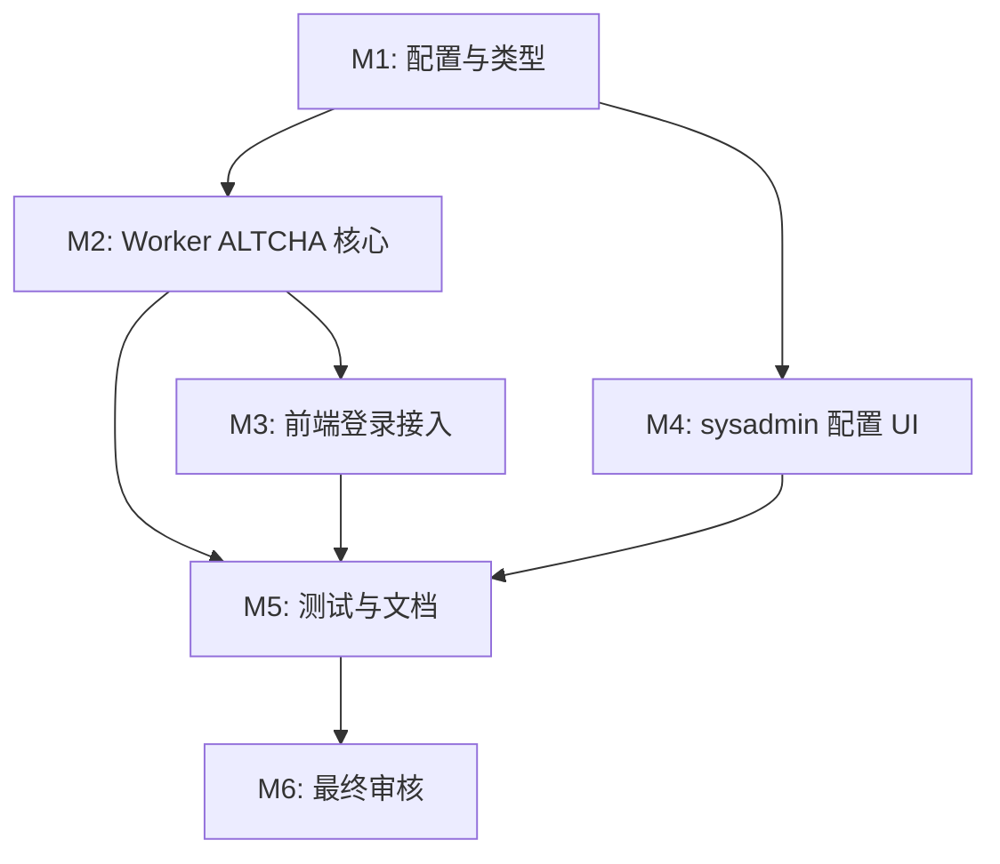

# 任务列表 — ALTCHA 开源验证码 Provider

**关联需求**: [`requirements.md`](./requirements.md)
**估算量级**: 中 (审核轮数：5)
**总体进度**: ✅ 10 / 10

---

## 状态图例

| Emoji | 状态   | 含义                       |
| ----- | ------ | -------------------------- |
| ⏳    | 待开始 | 还没开始                   |
| 🚧    | 进行中 | 当前正在做                 |
| ✅    | 已完成 | 自检通过、commit/push 完毕 |
| ⚠️    | 阻塞中 | 等待外部决策 / 修不动      |
| 🔍    | 待审核 | 自己做完了等用户 review    |

---

## 里程碑依赖图

---

## Milestone 1: 配置与类型

**目标**: 扩展 provider enum、数据库设置和环境变量。
**依赖**: 无
**状态**: ✅

### Task 1.1 ✅ 扩展验证码类型与数据库设置

**描述**: 在 server 类型、D1 schema、migration、settings fallback 中加入 `altcha` 和 `altchaDifficulty`。

**依赖**: 无
**阻塞**: T2.1, T4.1

**预估**: 1.5h

**关联文件 / 模块**:

- `server/src/lib/captcha/types.ts`
- `server/src/lib/captcha/settings.ts`
- `server/src/db/schema.ts`
- `server/migrations/0009_altcha_captcha.sql`
- `server/src/env.d.ts`

**验收**:

- [x] `captchaProviderSchema` 包含 `altcha`。
- [x] `captcha_settings` 支持 `altcha_difficulty`。
- [x] 默认难度可从环境变量兜底。

#### 备注

- 🐛 **遇到的问题**: 无阻塞；注意 schema enum、Zod enum、环境变量和 migration 必须同步。
- 🔧 **最终实现逻辑**: 扩展 `captchaProviderSchema`、`captcha_settings.altcha_difficulty`、`ALTCHA_DEFAULT_DIFFICULTY` / `ALTCHA_HMAC_KEY` 环境类型与 wrangler 默认值。
- 🎯 **关键决策**: 难度范围固定为 `10_000..200_000`，默认 `50_000`，避免 sysadmin 配置过高拖慢移动端。

---

### Task 1.2 ✅ 更新 sysadmin preferences API 契约

**描述**: GET/PATCH preferences 返回并保存 ALTCHA 难度。

**依赖**: T1.1
**阻塞**: T4.1

**预估**: 1h

**关联文件 / 模块**:

- `server/src/routes/sysadmin/preferences.ts`
- `server/test/captcha.test.ts`

**验收**:

- [x] PATCH 支持 `captcha.altchaDifficulty`。
- [x] 非法难度返回校验错误。

#### 备注

- 🐛 **遇到的问题**: 无。
- 🔧 **最终实现逻辑**: sysadmin preferences Zod schema 复用 `altchaDifficultySchema`，GET/PATCH 通过 `CaptchaSettingsDto` 返回和保存难度。
- 🎯 **关键决策**: 难度与 provider 作为同一 `captcha` 配置对象保存，保持现有 sysadmin API 风格。

---

## Milestone 2: Worker ALTCHA 核心

**目标**: 实现 challenge 签发、proof 校验和 provider 分派。
**依赖**: M1
**状态**: ✅

### Task 2.1 ✅ 实现 ALTCHA challenge 与验证库

**描述**: 新建 `server/src/lib/captcha/altcha.ts`，使用 Web Crypto 生成/校验 challenge。

**依赖**: T1.1
**阻塞**: T2.2, T2.3

**预估**: 3h

**关联文件 / 模块**:

- `server/src/lib/captcha/altcha.ts`
- `server/test/captcha.test.ts`

**验收**:

- [x] 能生成 ALTCHA Widget v3 可消费的 challenge。
- [x] 能校验有效 payload。
- [x] 篡改、过期、重复 proof 均失败。

#### 备注

- 🐛 **遇到的问题**: Cloudflare Workers CPU 有限，不能选择服务端高成本 KDF 校验。
- 🔧 **最终实现逻辑**: 新增 `server/src/lib/captcha/altcha.ts`，生成 Widget v3 原生 `SHA-256` challenge，校验 HMAC、solution、expiresAt、难度上限，并通过 Durable Object replay key 防重放；KV 仅作为 fallback。
- 🎯 **关键决策**: 采用 ALTCHA Widget v3 原生 challenge，前端使用 `altcha/external` 和同源 SHA worker，避免生产 CSP 放开 `blob:` / `data:` worker。

---

### Task 2.2 ✅ 暴露公共 challenge API

**描述**: 新增 `GET /api/captcha/altcha/challenge`，返回当前地区/配置下的 signed challenge。

**依赖**: T2.1
**阻塞**: T3.1

**预估**: 1h

**关联文件 / 模块**:

- `server/src/index.ts`
- `server/src/routes/`
- `docs/API.md`

**验收**:

- [x] 接口无需登录。
- [x] 配置缺失时 fail closed。
- [x] 不泄露 HMAC key。

#### 备注

- 🐛 **遇到的问题**: 无。
- 🔧 **最终实现逻辑**: 在 Worker 入口新增 `GET /api/captcha/altcha/challenge`，返回 `createAltchaChallenge` 结果。
- 🎯 **关键决策**: challenge URL 固定为相对路径，便于同域 Cookie/CSP 和多环境部署。

---

### Task 2.3 ✅ 接入 verifyCaptcha 分派

**描述**: `/api/config` 返回 ALTCHA public config，登录校验识别 `{ provider: "altcha", payload }`。

**依赖**: T2.1, T2.2
**阻塞**: T3.1

**预估**: 1h

**关联文件 / 模块**:

- `server/src/lib/captcha/index.ts`
- `server/src/lib/captcha/types.ts`
- `server/src/routes/auth.ts`

**验收**:

- [x] provider mismatch 失败。
- [x] ALTCHA 校验失败消耗登录限流。
- [x] Tencent/Turnstile/disabled 行为不变。

#### 备注

- 🐛 **遇到的问题**: 无。
- 🔧 **最终实现逻辑**: `/api/config` 对 `altcha` 返回 `challengeUrl`，`verifyCaptcha` 对 `provider=altcha` 调用 `verifyAltchaCaptcha`。
- 🎯 **关键决策**: 维持 `verifyCaptcha` 返回 boolean，由 auth route 统一处理限流和 403。

---

## Milestone 3: 前端登录接入

**目标**: 登录页支持 ALTCHA Widget v3。
**依赖**: M2
**状态**: ✅

### Task 3.1 ✅ 安装并加载 ALTCHA Widget v3

**描述**: 添加 `altcha@3.0.9`，扩展 `useLoginCaptcha`，按 provider 渲染 widget 并生成 proof。

**依赖**: T2.2, T2.3
**阻塞**: T3.2

**预估**: 2.5h

**关联文件 / 模块**:

- `web/package.json`
- `pnpm-lock.yaml`
- `web/src/views/auth/captchaLoaders.ts`
- `web/src/views/auth/useLoginCaptcha.ts`
- `web/src/views/auth/Login.vue`
- `web/src/vite-env.d.ts`

**验收**:

- [x] provider 为 `altcha` 时显示 widget。
- [x] verified 后提交 payload。
- [x] retry/reset 不影响 Tencent/Turnstile。

#### 备注

- 🐛 **遇到的问题**: `vite-env.d.ts` 变成模块后需要用 `declare global` 恢复 Window 类型增强。
- 🔧 **最终实现逻辑**: 安装 `altcha@3.0.9`，`captchaLoaders.ts` 动态 import 本地 Web Component 与中文翻译，`useLoginCaptcha` 监听 `statechange`/`verified` 写入 `{ provider: "altcha", payload }`。
- 🎯 **关键决策**: 设置 `workers: 1`，降低客户端资源占用；不新增远程脚本域。

---

### Task 3.2 ✅ 完善登录状态文案与 CSP

**描述**: 更新 i18n 和 CSP；ALTCHA 走本地包时不应额外放开第三方脚本域。

**依赖**: T3.1
**阻塞**: T5.1

**预估**: 1h

**关联文件 / 模块**:

- `web/src/locales/zh-CN.json`
- `web/src/locales/en-US.json`
- `server/src/middleware/security.ts`

**验收**:

- [x] 中文/英文文案完整。
- [x] CSP 不引入不必要的远程域。

#### 备注

- 🐛 **遇到的问题**: 无。
- 🔧 **最终实现逻辑**: ALTCHA 使用打包依赖并注册同源 worker，CSP 增加 `worker-src 'self'`，不额外放开远程脚本域。
- 🎯 **关键决策**: 使用 `altcha/external` 避免默认包创建 `blob:` / `data:` worker，减少 CSP 攻击面。

---

## Milestone 4: sysadmin 配置 UI

**目标**: 系统管理员可选择 ALTCHA 并配置难度。
**依赖**: M1
**状态**: ✅

### Task 4.1 ✅ 更新 Preferences UI

**描述**: 在登录验证码设置中加入 ALTCHA 难度输入，保存后回显来源和更新时间。

**依赖**: T1.1, T1.2
**阻塞**: T5.1

**预估**: 2h

**关联文件 / 模块**:

- `web/src/views/sysadmin/Preferences.vue`
- `web/src/locales/zh-CN.json`
- `web/src/locales/en-US.json`

**验收**:

- [x] 难度输入有范围限制。
- [x] 保存 payload 包含 `altchaDifficulty`。
- [x] provider 选项展示 ALTCHA。

#### 备注

- 🐛 **遇到的问题**: 无。
- 🔧 **最终实现逻辑**: Preferences UI 增加数字输入，GET/PATCH 同步 `altchaDifficulty`，中英文文案说明范围和性能影响。
- 🎯 **关键决策**: 难度显示在同一个验证码配置卡片里，避免新建独立页面。

---

## Milestone 5: 测试与文档

**目标**: 覆盖关键安全路径并更新用户/运维文档。
**依赖**: M2, M3, M4
**状态**: ✅

### Task 5.1 ✅ 补测试

**描述**: 增加 settings、challenge、verify、登录失败路径、前端 store/组件相关测试。

**依赖**: T2.3, T3.1, T4.1
**阻塞**: T5.2

**预估**: 2h

**关联文件 / 模块**:

- `server/test/captcha.test.ts`
- `web/src/.../*.test.ts`

**验收**:

- [x] 服务端测试覆盖 ALTCHA 有效/无效/重放。
- [x] 现有验证码测试不回退。

#### 备注

- 🐛 **遇到的问题**: 前端 ALTCHA Web Component 端到端验证需要浏览器环境，当前先用类型检查和后端核心测试覆盖。
- 🔧 **最终实现逻辑**: `server/test/captcha.test.ts` 增加 ALTCHA public config、有效 proof、重放和篡改测试。
- 🎯 **关键决策**: 核心安全逻辑放在服务端单测；UI 行为由类型检查、lint 和最终手动/浏览器验证补充。

---

### Task 5.2 ✅ 更新文档

**描述**: 更新 README、API、DATABASE、SECURITY、DEPLOYMENT、TESTING 文档。

**依赖**: T5.1
**阻塞**: T6.1

**预估**: 1.5h

**关联文件 / 模块**:

- `README.md`
- `docs/API.md`
- `docs/DATABASE.md`
- `docs/SECURITY.md`
- `docs/DEPLOYMENT.md`
- `docs/TESTING.md`

**验收**:

- [x] 文档说明 provider、payload、环境变量和运维配置。
- [x] 不遗漏 migration 流程。

#### 备注

- 🐛 **遇到的问题**: OpenAPI 仍停留在旧 Turnstile-only 描述，需要同步公共配置、登录 payload 和 sysadmin preferences。
- 🔧 **最终实现逻辑**: 更新 README、API、DATABASE、SECURITY、DEPLOYMENT、TESTING 和 OpenAPI 文档，补充 ALTCHA provider、challenge URL、payload、secret 和 migration 说明。
- 🎯 **关键决策**: 文档明确 Cloudflare Worker 只做常数次 HMAC/SHA-256 与 replay 消费，PoW 求解不放在 Worker。

---

## Milestone 6: 最终审核

**目标**: 5 轮自检并完成提交。
**依赖**: M5
**状态**: 🚧

### Task 6.1 ✅ 验证、审核、提交

**描述**: 跑 lint/typecheck/test/build 可行子集，完成 5 轮审核报告并创建 commit。

**依赖**: T5.2
**阻塞**: 无

**预估**: 2h

**关联文件 / 模块**:

- `docs/altcha-captcha/review-round-*.md`
- Git commit

**验收**:

- [x] `pnpm lint` 通过。
- [x] `pnpm typecheck` 通过。
- [x] `pnpm test` 通过。
- [x] `pnpm build` 通过。
- [x] commit 创建成功。

#### 备注

- 🐛 **遇到的问题**: 本地浏览器 smoke 两次受 Wrangler 远程连接超时/重置影响未完成；详见 review round 5。
- 🔧 **最终实现逻辑**: 完成 5 轮审核报告，验证 `pnpm lint`、`pnpm typecheck`、`pnpm test`、`pnpm build`、`git diff --check`。
- 🎯 **关键决策**: 以自动化测试和 dry-run build 作为当前网络条件下的发布门槛，保留后续真实浏览器 smoke 复测记录。

---

## 进度总览

| 里程碑   | 任务               | 完成   | 总数   | 状态   |
| -------- | ------------------ | ------ | ------ | ------ |
| M1       | 配置与类型         | 2      | 2      | ✅     |
| M2       | Worker ALTCHA 核心 | 3      | 3      | ✅     |
| M3       | 前端登录接入       | 2      | 2      | ✅     |
| M4       | sysadmin 配置 UI   | 1      | 1      | ✅     |
| M5       | 测试与文档         | 2      | 2      | ✅     |
| M6       | 最终审核           | 1      | 1      | ✅     |
| **总计** |                    | **10** | **10** | **✅** |

---

## 变更记录

| 日期       | 变更            |
| ---------- | --------------- |
| 2026-05-12 | 初稿，10 个任务 |

---

## 最终审核索引

| Round | 视角            | 状态 | 报告                                       |
| ----- | --------------- | ---- | ------------------------------------------ |
| 1     | 功能            | ✅   | [`review-round-1.md`](./review-round-1.md) |
| 2     | 类型 & 静态分析 | ✅   | [`review-round-2.md`](./review-round-2.md) |
| 3     | 性能            | ✅   | [`review-round-3.md`](./review-round-3.md) |
| 4     | 安全            | ✅   | [`review-round-4.md`](./review-round-4.md) |
| 5     | UX & a11y       | ✅   | [`review-round-5.md`](./review-round-5.md) |
