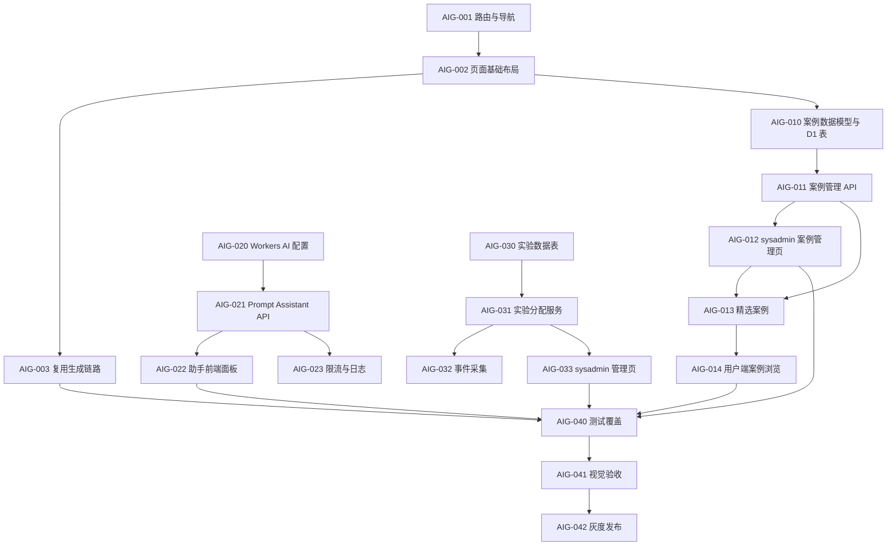

# AI 图像生成页面开发任务列表

状态：**已归档**（工程侧 Phase 1–5 与专项测试已完成；仅 **AIG-042** 中未勾选项为生产环境灰度运营动作。）
需求文档：[`../design-docs/ai-image-generation-page.md`](../design-docs/ai-image-generation-page.md)
短链入口：[`../exec-plans/ai-image-generation-page-tasks.md`](../exec-plans/ai-image-generation-page-tasks.md)
最后更新：2026-05-06

> **代码演进**：文内部分文件/路由名（如 `experiments.ts`、`generationExperience`、`POST /api/experiments/events`）对应历史实现快照；当前主线见 [`../EXPERIMENTS.md`](../EXPERIMENTS.md) 与 `server/src/lib/generationEntry.ts`。

## 状态约定

| 状态     | 含义                       |
| -------- | -------------------------- |
| TODO     | 尚未开始。                 |
| DOING    | 正在开发。                 |
| REVIEW   | 已实现，待测试或代码审查。 |
| DONE     | 已完成并验证。             |
| BLOCKED  | 受外部条件阻塞。           |
| DEFERRED | 本期不做，保留跟踪。       |

## 总览

| ID     | 里程碑           | 状态 | 需求锚点               | 完成证据                                           |
| ------ | ---------------- | ---- | ---------------------- | -------------------------------------------------- |
| AIG-M1 | 独立页面骨架     | DONE | 信息架构、Phase 1      | 路由、导航、移动端 sheet 和空状态可访问。          |
| AIG-M2 | 案例库管理与归因 | DONE | 案例库需求、Phase 2    | sysadmin 可管理案例，用户端可筛选回填。            |
| AIG-M3 | AI 提示词助手    | DONE | AI 提示词助手、Phase 3 | 自然对话最多 8 次来回，可生成并确认 final prompt。 |
| AIG-M4 | A/B 测试管理     | DONE | A/B 测试管理、Phase 4  | sysadmin 可启停实验并查看指标。                    |
| AIG-M5 | 验证与发布       | DONE | Phase 5、成功指标      | 测试与视觉验收完成；生产灰度勾选见 AIG-042。       |

## AIG-M1：独立页面骨架

### AIG-001 路由与导航

状态：DONE
依赖：无
涉及文件：`web/src/router/index.ts`、`web/src/components/layout/AppShell.vue`、`web/src/locales/*.json`

- [x] 新增 `/ai-image` 路由，页面组件指向 `web/src/views/ai-image/AiImageGeneration.vue`。
- [x] 保留 `/workspace` 为“图像生成”专业页。
- [x] 普通用户导航支持实验分配后的主入口展示。
- [x] sysadmin 导航同时展示“图像生成”和“AI 图像生成”。

验收：

- 未登录访问 `/ai-image` 跳转登录。
- 普通用户可访问 `/ai-image`。
- sysadmin 可从侧边栏进入两个生成页面。

### AIG-002 AI 图像生成页面基础布局

状态：DONE
依赖：AIG-001
涉及文件：`web/src/views/ai-image/AiImageGeneration.vue`

- [x] 实现桌面端三栏布局：案例库、案例详情、提示词/生成面板。
- [x] 实现移动端分类横向滚动与详情 sheet。
- [x] 显示配额、当前 provider 能力、生成状态。
- [x] 页面空状态引导用户选择案例或打开 AI 助手。

验收：

- 桌面和移动端无横向溢出。
- 无案例选择或清空 prompt 后页面仍可直接输入 prompt，并可进入 AI 助手。

### AIG-003 复用现有生成任务链路

状态：DONE
依赖：AIG-002
涉及文件：`web/src/views/ai-image/useAiImageGenerationSubmit.ts`、`web/src/stores/session.ts`

- [x] 从 AI 图像生成页调用现有 `/api/generate`。
- [x] 文生图、图生图上传参考图行为与工作台一致。
- [x] 接入现有 WebSocket 任务状态合并逻辑。
- [x] 生成成功后结果进入现有历史记录。

验收：

- `/ai-image` 生成出的会话可在 `/history` 查看。
- 失败任务沿用现有错误展示和重试策略。

### AIG-004 参考图便捷添加

状态：DONE
依赖：AIG-003
涉及文件：`web/src/components/chat/ChatInput.vue`、`web/src/views/ai-image/AiImagePromptPanel.vue`、`web/src/utils/referenceImageFiles.ts`

- [x] `/workspace` 图生图上传区域支持点击上传、拖拽图片和粘贴图片。
- [x] `/ai-image` 图生图上传区域支持点击上传、拖拽图片和粘贴图片。
- [x] 两个入口复用统一参考图筛选与压缩逻辑。
- [x] 上传区域文案明确提示点击、粘贴和拖拽三种入口。

验收：

- 在 `/workspace` 图生图模式拖拽/粘贴图片后出现参考图预览。
- 在 `/ai-image` 图生图模式拖拽/粘贴图片后出现参考图预览。
- 非图片内容不会被加入参考图队列。

## AIG-M2：案例库管理与归因

### AIG-010 案例数据模型与 D1 表

状态：DONE
依赖：AIG-002
涉及文件：`server/src/db/schema.ts`、`server/migrations/*`、`web/src/types/promptCases.ts`

- [x] 定义 `PromptCase` 类型。
- [x] 新增 `prompt_cases` 表，字段覆盖分类、标签、模式、推荐尺寸、prompt 模板、状态、排序、精选、语言、来源归因。
- [x] 新增 `prompt_case_imports` 表，记录导入批次、来源、导入人、导入结果和错误。
- [x] 支持 `draft`、`published`、`hidden`、`archived` 状态。
- [x] 支持 `text2image` 与 `image2image` 过滤。

验收：

- TypeScript 类型覆盖所有案例字段。
- D1 migration 可在本地执行。
- 无来源信息的外部案例不能发布。

### AIG-011 案例管理 API

状态：DONE
依赖：AIG-010
涉及文件：`server/src/routes/promptCases.ts`、`server/src/routes/sysadmin/promptCases.ts`、`server/src/lib/promptCases.ts`

- [x] 新增用户端 `GET /api/prompt-cases`，只返回已发布案例。
- [x] 新增 sysadmin `GET /api/sysadmin/prompt-cases`。
- [x] 新增 sysadmin `POST /api/sysadmin/prompt-cases`。
- [x] 新增 sysadmin `PATCH /api/sysadmin/prompt-cases/:id`。
- [x] 新增 sysadmin `POST /api/sysadmin/prompt-cases/import`，导入后默认 draft。
- [x] 校验外部来源案例必须包含 `sourceUrl`、`sourceAuthor`、`sourceLicense`。

验收：

- 普通用户无法访问写接口。
- 发布状态变更后用户端列表同步变化。

### AIG-012 系统管理员案例管理页

状态：DONE
依赖：AIG-011
涉及文件：`web/src/views/sysadmin/PromptCases.vue`、`web/src/router/index.ts`、`web/src/components/layout/AppShell.vue`

- [x] 新增 `/sysadmin/prompt-cases`。
- [x] 支持按状态、分类、模式、语言、来源、精选、搜索词筛选。
- [x] 支持创建、编辑、发布、隐藏、归档、排序、设置精选。
- [x] 支持粘贴 JSON 或导入脚本产物，导入后进入 draft。
- [x] 支持普通用户视角预览案例详情和 prompt 回填。
- [x] 拆分案例管理页：列表表格和导入弹层独立成组件，主页面保持装配职责。
- [x] 抽离案例编辑表单规则：克隆、标签清洗、空字符串转 null 和模式切换都有纯函数测试。

验收：

- 仅 sysadmin 可访问。
- 外部来源字段在发布前必须补齐。

### AIG-013 精选 awesome-gpt-image-2-prompts 案例

状态：DONE
依赖：AIG-011、AIG-012
参考来源：[EvoLinkAI/awesome-gpt-image-2-prompts](https://github.com/EvoLinkAI/awesome-gpt-image-2-prompts)

- [x] 从人像摄影、商品广告、海报插画、角色、UI/社媒、信息图、视频关键帧中各选 3-5 个。
- [x] 保留 `sourceUrl`、`sourceAuthor`、`sourceLicense`、`sourceRepo`。
- [x] 将外部 prompt 改写为中文可填槽位模板，避免不归因复制。
- [x] 为每个案例标注推荐尺寸和适用模式。
- [x] 通过 sysadmin 管理页发布首批案例。

验收：

- MVP 案例总量在 20-30 个。
- 每个外部案例页面可见归因信息。

### AIG-014 用户端案例浏览与筛选

状态：DONE
依赖：AIG-011、AIG-013
涉及文件：`PromptCaseGallery.vue`、`PromptCaseDetail.vue`

- [x] 从 `GET /api/prompt-cases` 加载已发布案例。
- [x] 支持分类 tabs。
- [x] 支持按模式、尺寸、标签筛选。
- [x] 案例卡片展示标题、缩略图、标签、来源。
- [x] 案例详情展示 prompt 摘要、推荐尺寸、来源归因。

验收：

- 选择案例后可回填 prompt 模板。
- 图生图案例在未上传参考图时提示上传。

## AIG-M3：AI 提示词助手

### AIG-020 Workers AI 配置

状态：DONE
依赖：无
涉及文件：`server/wrangler.jsonc`、`server/src/types.ts`

- [x] 增加 Workers AI binding。
- [x] 增加 `PROMPT_ASSISTANT_MODEL` 环境变量约定。
- [x] 运行 `pnpm -F server types` 更新环境类型。
- [x] 文档注明本地开发缺少 AI binding 时的降级行为。

验收：

- 服务端类型包含 `AI` binding。
- 未配置模型时接口返回可控错误或静态降级。

### AIG-021 Prompt Assistant API

状态：DONE
依赖：AIG-020
涉及文件：`server/src/routes/promptAssistant.ts`、`server/src/lib/promptAssistant.ts`

- [x] 新增 `POST /api/prompt-assistant/turn`。
- [x] 使用 Zod 校验 mode、locale、turnIndex、messages、provider、referenceBrief。
- [x] 限制只允许 `text2image`、`image2image`。
- [x] 输出 `assistantMessage`、`readiness`、`brief`、`finalPrompt`、`recommendedSize`、`warnings`。

验收：

- `chat` mode 请求被拒绝。
- Workers AI 失败时返回静态模板降级。

### AIG-022 助手前端面板

状态：DONE
依赖：AIG-021
涉及文件：`PromptAssistantPanel.vue`、`useAiImageGenerationSubmit.ts`

- [x] 实现自然聊天式历史，不向用户展示“第几轮”。
- [x] AI 与用户最多来回问答 8 次，每次只展示 1-2 个问题。
- [x] 信息足够时允许提前输出最终 prompt。
- [x] 支持最终 prompt 手动编辑确认、回填、复制、继续调整、清空对话。
- [x] 拆分助手展示层：聊天历史与最终 prompt 确认区独立成组件，主面板只负责请求与状态。

验收：

- 回填后用户仍需点击“生成图片”才消耗配额。
- 助手对话不会出现在现有 `chat` 会话模式中。

### AIG-023 助手限流与安全日志

状态：DONE
依赖：AIG-021
涉及文件：`server/src/lib/promptAssistant.ts`、`server/src/middleware/rateLimit.ts`

- [x] 每用户每天默认 30 次助手请求。
- [x] 单次输入最大 6,000 字符，输出最大 1,500 字符。
- [x] 日志只记录长度、模式、caseId、turnIndex、模型名和 traceId。
- [x] 不记录完整 prompt、参考图内容或密钥。

验收：

- 超限返回统一错误体。
- 日志脱敏检查通过。

## AIG-M4：A/B 测试管理

### AIG-030 实验数据表

状态：DONE
依赖：无
涉及文件：`server/src/db/schema.ts`、`server/migrations/*`

- [x] 新增 `experiments`。
- [x] 新增 `experiment_assignments`。
- [x] 新增 `experiment_events`。
- [x] 生成并提交 D1 migration。

验收：

- `pnpm -F server db:gen` 生成 SQL。
- 本地迁移可执行。

### AIG-031 实验分配服务

状态：DONE
依赖：AIG-030
涉及文件：`server/src/lib/experiments.ts`、`server/src/routes/me.ts`

- [x] 固定实验 key：`generation_experience`。
- [x] 支持策略：并列展示、强制旧版、强制新版、A/B 测试。
- [x] 使用 `userId + experimentKey + salt` 稳定哈希分配。
- [x] `/api/me` 返回当前用户 `generationExperience`。

验收：

- 同一用户多次刷新分配稳定。
- sysadmin 不参与普通用户实验分配。

### AIG-032 实验事件采集

状态：DONE
依赖：AIG-030、AIG-031
涉及文件：`server/src/routes/experiments.ts`、`web/src/api/client.ts`

- [x] 新增 `POST /api/experiments/events`。
- [x] 支持曝光、页面打开、案例选择、助手回填、生成提交、任务结果事件。
- [x] 过滤 sysadmin 预览事件或标记 `isSysadminPreview`。
- [x] 不存完整 prompt。
- [x] 统一记录 `/workspace` 与 `/ai-image` 的入口曝光、页面打开和直接访问另一变体事件。

验收：

- 事件写入 D1。
- 指标字段可按 variant 聚合。

### AIG-033 系统管理员实验管理页

状态：DONE
依赖：AIG-030、AIG-031
涉及文件：`web/src/views/sysadmin/GenerationExperiment.vue`、`server/src/routes/sysadmin/generationExperiment.ts`

- [x] 新增 `/sysadmin/experiments/generation`。
- [x] 支持查看状态、入口策略、流量配置、适用范围。
- [x] 支持 draft、running、paused、archived 状态流转。
- [x] 支持 0/25/50/75/100 流量档位。
- [x] 展示曝光、打开、prompt 回填、提交、成功、失败指标。

验收：

- 仅 sysadmin 可访问。
- 保存后普通用户 `/api/me` 返回新策略。

## AIG-M5：验证与发布

### AIG-040 测试覆盖

状态：DONE
依赖：AIG-M1、AIG-M2、AIG-M3、AIG-M4
涉及文件：`*.test.ts`、`*.spec.ts`

- [x] 后端：prompt assistant schema、Workers AI 降级路径、实验事件 schema 与脱敏测试。
- [x] 后端：实验 scope 规则测试覆盖用户白名单、指定 admin 名下用户与排除名单。
- [x] 后端：案例管理写入/发布过滤、实验分配、事件写入和指标聚合的 D1 集成测试。
- [x] 前端：参考图文件筛选与压缩降级工具测试。
- [x] 前端：导航分配与直达切换事件纯函数测试覆盖曝光、打开和去重边界。
- [x] 前端：案例筛选、prompt 回填默认值、sysadmin 案例导入解析和首页落点纯函数测试。
- [x] 前端：sysadmin 案例管理控制器交互测试覆盖加载选择、筛选后选择同步、创建/编辑、状态流转、精选切换和导入。
- [x] 前端：路由守卫判断测试覆盖未登录跳转、登录后首页、admin/sysadmin 权限与 bootstrap 条件。
- [x] 前端：页面组件级案例管理交互测试，覆盖案例编辑弹层、导入弹层和案例表格行级操作。
- [x] 前端：专业工作台提交实验事件、失败重试请求上下文、Prompt 助手参考图变化 reset 回归测试。
- [x] Store：`generationExperience` 写入、刷新与登出清理测试。
- [x] 回归：现有 session store 任务事件合并测试继续通过。

验收：

- `pnpm typecheck` 通过。
- `pnpm test` 通过。

### AIG-041 视觉与交互验收

状态：DONE
依赖：AIG-002、AIG-012、AIG-014、AIG-022、AIG-033

- [x] 桌面端检查 `/ai-image`。
- [x] 移动端检查 `/ai-image`。
- [x] 检查 sysadmin 案例管理页。
- [x] 检查 sysadmin 实验管理页。
- [x] 检查文本不溢出、按钮状态、加载状态、错误状态。
- [x] Workers AI 降级 warnings 在助手面板可见。
- [x] 审核 01/02 修复后重新执行桌面、移动端浏览器复测。
- [x] 审核 03 修复后使用本机 Chrome 复测移动端、`1280x600`、`1920x1080` 与 4K 视口。
- [x] 审核 05 使用本机 Chrome 复测 `/ai-image` 移动端 `390x844`、`/ai-image` PC `1280x600` 与 `/workspace` PC `1280x600`。

验收：

- 审核修复后的页面在桌面和移动端无明显重叠、截断和空白。
- Workers AI 降级状态可被用户理解。

### AIG-042 灰度发布

状态：TODO
依赖：AIG-040、AIG-041

- [x] 发布前默认入口策略为并列展示或强制旧版；当前无实验记录时为 `draft + parallel`，sysadmin 表单初始值也为 `draft + parallel`。
- [x] sysadmin 实验页提供灰度预设：回滚旧版、并列展示、当前范围强制新版、25% B 变体。
- [x] sysadmin 实验页提供保存前风险摘要，覆盖无效 JSON、全量强制新版、高流量 B 变体、`mode: off` 和仅排除名单仍属全量范围等误操作场景。
- [ ] 先对内部用户开启 AI 图像生成。
- [ ] 再对 25% 普通用户开启 B 变体。
- [ ] 观察 3 天核心指标后决定是否扩大流量。
- [x] 修复审核 05 发现的 `/workspace` A 变体生成提交/结果事件缺口与失败重试指标缺口。
- [x] 修复审核 06 发现的 A/B 指标口径问题：`chat` 模式排除默认漏斗、失败重试独立指标、参考图同数量替换 reset。
- [x] 修复审核 07 发现的任务生命周期实验事件边界问题：公开事件入口禁止 `generate_*`，服务端终态事件只信任服务端来源。
- [x] 优化审核 07 发现的 sysadmin 指标聚合性能问题：增加最近 30 天统计窗口，并在页面显示当前窗口。

验收：

- 可从 sysadmin 页面回滚到强制旧版。
- A/B 指标能区分 variant A 与 variant B。

## 任务依赖图

## 更新记录

| 日期       | 变更                                                                                                                                                                                      |
| ---------- | ----------------------------------------------------------------------------------------------------------------------------------------------------------------------------------------- |
| 2026-04-28 | 初版：按独立 AI 图像生成页、案例库、AI 助手和 A/B 测试管理拆分任务。                                                                                                                      |
| 2026-04-28 | 实现收尾：补移动端详情 sheet、空状态 AI 助手引导、助手启动事件、降级提示和专项测试；灰度发布仍待线上执行。                                                                                |
| 2026-04-28 | 追加图生图交互：`/workspace` 与 `/ai-image` 参考图区域支持点击上传、粘贴图片和拖拽图片。                                                                                                  |
| 2026-04-28 | 补齐 A/B scope 生效逻辑与入口级事件采集：曝光、页面打开、直接访问另一变体。                                                                                                               |
| 2026-04-28 | 抽离入口实验事件纯函数并补前端单测，覆盖导航曝光、直达切换和去重。                                                                                                                        |
| 2026-04-28 | 补前端纯函数测试：案例筛选、prompt 回填、案例导入归一化和默认首页落点。                                                                                                                   |
| 2026-04-28 | 补 Miniflare D1 集成测试：案例发布过滤、导入批次、实验分配、事件脱敏和指标聚合。                                                                                                          |
| 2026-04-28 | 灰度发布前默认策略检查：默认 `draft + parallel`，生产灰度执行仍待 sysadmin 操作。                                                                                                         |
| 2026-04-28 | 优化 AI 提示词助手交互：自然聊天历史、最多 8 次来回、最终 prompt 可编辑确认后回填。                                                                                                       |
| 2026-04-28 | 抽离路由守卫判断并补单测，覆盖登录态、A/B 首页落点和角色权限边界。                                                                                                                        |
| 2026-04-28 | 增加 sysadmin 生成实验灰度预设按钮，降低回滚、内部试用和 25% B 变体配置失误风险。                                                                                                         |
| 2026-04-28 | 补 sysadmin 生成实验保存前风险摘要：前端范围判断与后端 scope 语义对齐，避免仅排除名单被误判为定向范围。                                                                                   |
| 2026-04-28 | 修复本地登录 Turnstile 跳过逻辑：dev 环境不下发 site key，避免 localhost 触发 110200 阻塞 `/ai-image` 验证。                                                                              |
| 2026-04-28 | 补 sysadmin 案例管理控制器交互测试，并修复筛选刷新后 selectedId 未同步导致表格高亮与预览不一致的问题。                                                                                    |
| 2026-04-28 | 拆分 sysadmin 案例管理页：提取 `PromptCaseTable` 与 `PromptCaseImportDialog`，降低单文件复杂度。                                                                                          |
| 2026-04-28 | 抽离案例编辑表单规则并补测试，覆盖保存前文本清洗、标签解析、归因空值和模式切换边界。                                                                                                      |
| 2026-04-28 | 拆分 AI Prompt 助手面板：提取聊天历史区与最终 Prompt 确认区，降低主组件复杂度。                                                                                                           |
| 2026-04-28 | 审核报告 01 修复：修正实验暂停语义、指标污染、生成提交上报、案例模式筛选、事件白名单与限流、助手语言映射，并补组件级案例管理测试。                                                        |
| 2026-04-28 | 审核报告 02 修复：任务结果事件复用提交时变体快照，案例库跟随 UI 语言并按 provider 模式能力过滤；AIG-041 回到 REVIEW 待浏览器复测。                                                        |
| 2026-04-28 | 审核报告 03 修复：提交实验事件改为服务端任务启动前写入，补 provider 能力同步、尺寸降级提示、无可用案例 prompt 来源规则与测试。                                                            |
| 2026-04-28 | 使用本机 Chrome 完成审核 03 复测：覆盖移动端 `390x844`、PC `1280x600`、`1920x1080`、`3840x2160`，以及 sysadmin 案例/实验管理页 `1280x600`；截图位于 `test-artifacts/chrome-responsive/`。 |
| 2026-04-28 | 审核报告 04 修复：任务成功/失败事件改为服务端终态写入，修正自由 prompt 案例归因、结果图作用域、助手上下文 reset 与缩略图 fallback。                                                       |
| 2026-04-28 | 审核报告 05：复核第四轮修复有效，新增发现 `/workspace` A 变体生成事件未闭环、失败重试指标缺口和参考图变化未 reset 助手上下文。                                                            |
| 2026-04-28 | 审核报告 05 修复：补齐 `/workspace` 提交实验事件、失败重试归因继承与 Prompt 助手参考图变化 reset，并补前后端回归测试。                                                                    |
| 2026-04-28 | 审核报告 06：第五轮修复主路径有效，新增发现 A/B 指标仍受 `/workspace` chat 模式、重试聚合口径和参考图同数量替换场景影响。                                                                 |
| 2026-04-28 | 审核报告 06 修复：`chat` 不再进入默认生成漏斗，sysadmin 指标新增重试派生项，Prompt 助手参考图上下文改用稳定 key。                                                                         |
| 2026-04-28 | 审核报告 07：第六轮修复有效，新增发现公开实验事件入口仍可写任务生命周期事件，且 sysadmin 指标聚合存在无界扫描风险。                                                                       |
| 2026-05-06 | 任务书迁入 `docs/archive/`；总览 AIG-M5 标为 DONE；保留 AIG-042 生产灰度待运维勾选。                                                                                                      |
