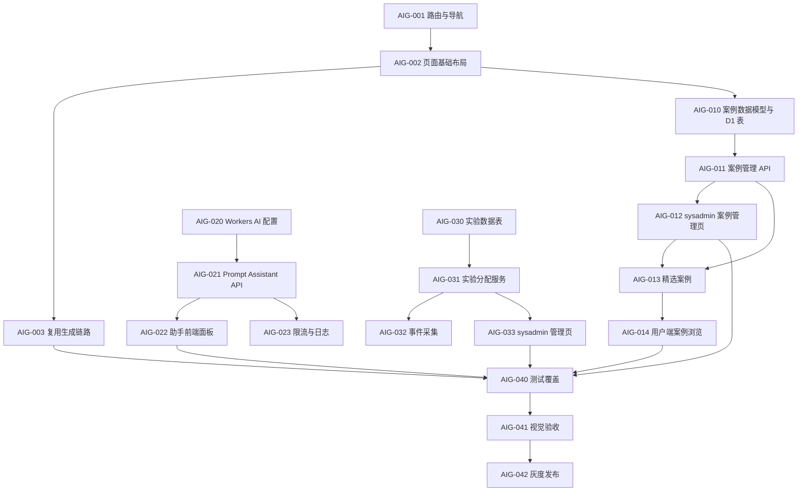

# AI 图像生成页面开发任务列表

状态：active  
需求文档：[`../design-docs/ai-image-generation-page.md`](../design-docs/ai-image-generation-page.md)  
最后更新：2026-04-28

## 状态约定

| 状态     | 含义                       |
| -------- | -------------------------- |
| TODO     | 尚未开始。                 |
| DOING    | 正在开发。                 |
| REVIEW   | 已实现，待测试或代码审查。 |
| DONE     | 已完成并验证。             |
| BLOCKED  | 受外部条件阻塞。           |
| DEFERRED | 本期不做，保留跟踪。       |

## 总览

| ID     | 里程碑           | 状态 | 需求锚点               | 完成证据                                |
| ------ | ---------------- | ---- | ---------------------- | --------------------------------------- |
| AIG-M1 | 独立页面骨架     | TODO | 信息架构、Phase 1      | 路由、导航和空页面可访问。              |
| AIG-M2 | 案例库管理与归因 | TODO | 案例库需求、Phase 2    | sysadmin 可管理案例，用户端可筛选回填。 |
| AIG-M3 | AI 提示词助手    | TODO | AI 提示词助手、Phase 3 | 6-10 轮问答可生成 final prompt。        |
| AIG-M4 | A/B 测试管理     | TODO | A/B 测试管理、Phase 4  | sysadmin 可启停实验并查看指标。         |
| AIG-M5 | 验证与发布       | TODO | Phase 5、成功指标      | 测试通过，灰度策略明确。                |

## AIG-M1：独立页面骨架

### AIG-001 路由与导航

状态：TODO  
依赖：无  
涉及文件：`web/src/router/index.ts`、`web/src/components/layout/AppShell.vue`、`web/src/locales/*.json`

- [ ] 新增 `/ai-image` 路由，页面组件指向 `web/src/views/ai-image/AiImageGeneration.vue`。
- [ ] 保留 `/workspace` 为“图像生成”专业页。
- [ ] 普通用户导航支持实验分配后的主入口展示。
- [ ] sysadmin 导航同时展示“图像生成”和“AI 图像生成”。

验收：

- 未登录访问 `/ai-image` 跳转登录。
- 普通用户可访问 `/ai-image`。
- sysadmin 可从侧边栏进入两个生成页面。

### AIG-002 AI 图像生成页面基础布局

状态：TODO  
依赖：AIG-001  
涉及文件：`web/src/views/ai-image/AiImageGeneration.vue`

- [ ] 实现桌面端三栏布局：案例库、案例详情、提示词/生成面板。
- [ ] 实现移动端分类横向滚动与详情 sheet。
- [ ] 显示配额、当前 provider 能力、生成状态。
- [ ] 页面空状态引导用户选择案例或打开 AI 助手。

验收：

- 桌面和移动端无横向溢出。
- 无案例选择时页面仍可直接输入 prompt。

### AIG-003 复用现有生成任务链路

状态：TODO  
依赖：AIG-002  
涉及文件：`web/src/views/ai-image/useAiImageGenerationController.ts`、`web/src/stores/session.ts`

- [ ] 从 AI 图像生成页调用现有 `/api/generate`。
- [ ] 文生图、图生图上传参考图行为与工作台一致。
- [ ] 接入现有 WebSocket 任务状态合并逻辑。
- [ ] 生成成功后结果进入现有历史记录。

验收：

- `/ai-image` 生成出的会话可在 `/history` 查看。
- 失败任务沿用现有错误展示和重试策略。

## AIG-M2：案例库管理与归因

### AIG-010 案例数据模型与 D1 表

状态：TODO  
依赖：AIG-002  
涉及文件：`server/src/db/schema.ts`、`server/src/db/migrations/*`、`web/src/views/ai-image/promptCases.ts`

- [ ] 定义 `PromptCase` 类型。
- [ ] 新增 `prompt_cases` 表，字段覆盖分类、标签、模式、推荐尺寸、prompt 模板、状态、排序、精选、语言、来源归因。
- [ ] 新增 `prompt_case_imports` 表，记录导入批次、来源、导入人、导入结果和错误。
- [ ] 支持 `draft`、`published`、`hidden`、`archived` 状态。
- [ ] 支持 `text2image` 与 `image2image` 过滤。

验收：

- TypeScript 类型覆盖所有案例字段。
- D1 migration 可在本地执行。
- 无来源信息的外部案例不能发布。

### AIG-011 案例管理 API

状态：TODO  
依赖：AIG-010  
涉及文件：`server/src/routes/promptCases.ts`、`server/src/routes/sysadmin/promptCases.ts`、`server/src/lib/promptCases.ts`

- [ ] 新增用户端 `GET /api/prompt-cases`，只返回已发布案例。
- [ ] 新增 sysadmin `GET /api/sysadmin/prompt-cases`。
- [ ] 新增 sysadmin `POST /api/sysadmin/prompt-cases`。
- [ ] 新增 sysadmin `PATCH /api/sysadmin/prompt-cases/:id`。
- [ ] 新增 sysadmin `POST /api/sysadmin/prompt-cases/import`，导入后默认 draft。
- [ ] 校验外部来源案例必须包含 `sourceUrl`、`sourceAuthor`、`sourceLicense`。

验收：

- 普通用户无法访问写接口。
- 发布状态变更后用户端列表同步变化。

### AIG-012 系统管理员案例管理页

状态：TODO  
依赖：AIG-011  
涉及文件：`web/src/views/sysadmin/PromptCases.vue`、`web/src/router/index.ts`、`web/src/components/layout/AppShell.vue`

- [ ] 新增 `/sysadmin/prompt-cases`。
- [ ] 支持按状态、分类、模式、语言、来源、精选、搜索词筛选。
- [ ] 支持创建、编辑、发布、隐藏、归档、排序、设置精选。
- [ ] 支持粘贴 JSON 或导入脚本产物，导入后进入 draft。
- [ ] 支持普通用户视角预览案例详情和 prompt 回填。

验收：

- 仅 sysadmin 可访问。
- 外部来源字段在发布前必须补齐。

### AIG-013 精选 awesome-gpt-image-2-prompts 案例

状态：TODO  
依赖：AIG-011、AIG-012  
参考来源：[EvoLinkAI/awesome-gpt-image-2-prompts](https://github.com/EvoLinkAI/awesome-gpt-image-2-prompts)

- [ ] 从人像摄影、商品广告、海报插画、角色、UI/社媒、信息图、视频关键帧中各选 3-5 个。
- [ ] 保留 `sourceUrl`、`sourceAuthor`、`sourceLicense`、`sourceRepo`。
- [ ] 将外部 prompt 改写为中文可填槽位模板，避免不归因复制。
- [ ] 为每个案例标注推荐尺寸和适用模式。
- [ ] 通过 sysadmin 管理页发布首批案例。

验收：

- MVP 案例总量在 20-30 个。
- 每个外部案例页面可见归因信息。

### AIG-014 用户端案例浏览与筛选

状态：TODO  
依赖：AIG-011、AIG-013  
涉及文件：`PromptCaseGallery.vue`、`PromptCaseDetail.vue`

- [ ] 从 `GET /api/prompt-cases` 加载已发布案例。
- [ ] 支持分类 tabs。
- [ ] 支持按模式、尺寸、标签筛选。
- [ ] 案例卡片展示标题、缩略图、标签、来源。
- [ ] 案例详情展示 prompt 摘要、推荐尺寸、来源归因。

验收：

- 选择案例后可回填 prompt 模板。
- 图生图案例在未上传参考图时提示上传。

## AIG-M3：AI 提示词助手

### AIG-020 Workers AI 配置

状态：TODO  
依赖：无  
涉及文件：`server/wrangler.jsonc`、`server/src/types.ts`

- [ ] 增加 Workers AI binding。
- [ ] 增加 `PROMPT_ASSISTANT_MODEL` 环境变量约定。
- [ ] 运行 `pnpm -F server types` 更新环境类型。
- [ ] 文档注明本地开发缺少 AI binding 时的降级行为。

验收：

- 服务端类型包含 `AI` binding。
- 未配置模型时接口返回可控错误或静态降级。

### AIG-021 Prompt Assistant API

状态：TODO  
依赖：AIG-020  
涉及文件：`server/src/routes/promptAssistant.ts`、`server/src/lib/promptAssistant.ts`

- [ ] 新增 `POST /api/prompt-assistant/turn`。
- [ ] 使用 Zod 校验 mode、locale、turnIndex、messages、provider、referenceBrief。
- [ ] 限制只允许 `text2image`、`image2image`。
- [ ] 输出 `assistantMessage`、`readiness`、`brief`、`finalPrompt`、`recommendedSize`、`warnings`。

验收：

- `chat` mode 请求被拒绝。
- Workers AI 失败时返回静态模板降级。

### AIG-022 助手前端面板

状态：TODO  
依赖：AIG-021  
涉及文件：`PromptAssistantPanel.vue`、`useAiImageGenerationController.ts`

- [ ] 实现 6-10 轮问答状态。
- [ ] 每轮只展示 1-2 个问题。
- [ ] 信息足够时允许提前输出最终 prompt。
- [ ] 支持回填、复制、继续调整、清空对话。

验收：

- 回填后用户仍需点击“生成图片”才消耗配额。
- 助手对话不会出现在现有 `chat` 会话模式中。

### AIG-023 助手限流与安全日志

状态：TODO  
依赖：AIG-021  
涉及文件：`server/src/lib/promptAssistant.ts`、`server/src/middleware/rateLimit.ts`

- [ ] 每用户每天默认 30 轮助手请求。
- [ ] 单轮输入最大 6,000 字符，输出最大 1,500 字符。
- [ ] 日志只记录长度、模式、caseId、turnIndex、模型名和 traceId。
- [ ] 不记录完整 prompt、参考图内容或密钥。

验收：

- 超限返回统一错误体。
- 日志脱敏检查通过。

## AIG-M4：A/B 测试管理

### AIG-030 实验数据表

状态：TODO  
依赖：无  
涉及文件：`server/src/db/schema.ts`、`server/src/db/migrations/*`

- [ ] 新增 `experiments`。
- [ ] 新增 `experiment_assignments`。
- [ ] 新增 `experiment_events`。
- [ ] 生成并提交 D1 migration。

验收：

- `pnpm -F server db:gen` 生成 SQL。
- 本地迁移可执行。

### AIG-031 实验分配服务

状态：TODO  
依赖：AIG-030  
涉及文件：`server/src/lib/experiments.ts`、`server/src/routes/me.ts`

- [ ] 固定实验 key：`generation_experience`。
- [ ] 支持策略：并列展示、强制旧版、强制新版、A/B 测试。
- [ ] 使用 `userId + experimentKey + salt` 稳定哈希分配。
- [ ] `/api/me` 返回当前用户 `generationExperience`。

验收：

- 同一用户多次刷新分配稳定。
- sysadmin 不参与普通用户实验分配。

### AIG-032 实验事件采集

状态：TODO  
依赖：AIG-030、AIG-031  
涉及文件：`server/src/routes/experiments.ts`、`web/src/api/client.ts`

- [ ] 新增 `POST /api/experiments/events`。
- [ ] 支持曝光、页面打开、案例选择、助手回填、生成提交、任务结果事件。
- [ ] 过滤 sysadmin 预览事件或标记 `isSysadminPreview`。
- [ ] 不存完整 prompt。

验收：

- 事件写入 D1。
- 指标字段可按 variant 聚合。

### AIG-033 系统管理员实验管理页

状态：TODO  
依赖：AIG-030、AIG-031  
涉及文件：`web/src/views/sysadmin/GenerationExperiment.vue`、`server/src/routes/sysadmin/generationExperiment.ts`

- [ ] 新增 `/sysadmin/experiments/generation`。
- [ ] 支持查看状态、入口策略、流量配置、适用范围。
- [ ] 支持 draft、running、paused、archived 状态流转。
- [ ] 支持 0/25/50/75/100 流量档位。
- [ ] 展示曝光、打开、prompt 回填、提交、成功、失败指标。

验收：

- 仅 sysadmin 可访问。
- 保存后普通用户 `/api/me` 返回新策略。

## AIG-M5：验证与发布

### AIG-040 测试覆盖

状态：TODO  
依赖：AIG-M1、AIG-M2、AIG-M3、AIG-M4  
涉及文件：`*.test.ts`、`*.spec.ts`

- [ ] 后端：案例管理 API、prompt assistant schema、实验分配、事件写入测试。
- [ ] 前端：案例管理、案例筛选、prompt 回填、路由守卫、导航分配测试。
- [ ] Store：`generationExperience` 持久化与刷新测试。
- [ ] 回归：现有 `/workspace` 生成不受影响。

验收：

- `pnpm typecheck` 通过。
- `pnpm test` 通过。

### AIG-041 视觉与交互验收

状态：TODO  
依赖：AIG-002、AIG-012、AIG-014、AIG-022、AIG-033

- [ ] 桌面端检查 `/ai-image`。
- [ ] 移动端检查 `/ai-image`。
- [ ] 检查 sysadmin 案例管理页。
- [ ] 检查 sysadmin 实验管理页。
- [ ] 检查文本不溢出、按钮状态、加载状态、错误状态。

验收：

- 页面在桌面和移动端无明显重叠、截断和空白。
- Workers AI 降级状态可被用户理解。

### AIG-042 灰度发布

状态：TODO  
依赖：AIG-040、AIG-041

- [ ] 发布前默认入口策略为并列展示或强制旧版。
- [ ] 先对内部用户开启 AI 图像生成。
- [ ] 再对 25% 普通用户开启 B 变体。
- [ ] 观察 3 天核心指标后决定是否扩大流量。

验收：

- 可从 sysadmin 页面回滚到强制旧版。
- A/B 指标能区分 variant A 与 variant B。

## 任务依赖图

## 更新记录

| 日期       | 变更                                                                 |
| ---------- | -------------------------------------------------------------------- |
| 2026-04-28 | 初版：按独立 AI 图像生成页、案例库、AI 助手和 A/B 测试管理拆分任务。 |
