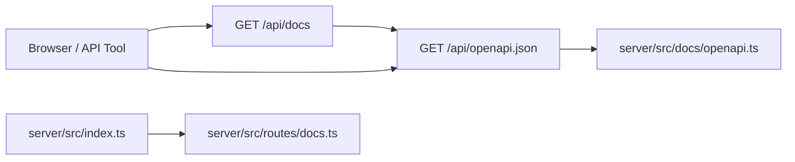

# API 文档支持需求

**版本**: v0.1
**日期**: 2026-04-30
**作者**: 用户 + AI
**状态**: 已交付
**关联任务列表**: [`tasks.md`](./tasks.md)

## 1. 背景

Edge Muse Platform 当前已有 Markdown API 文档，但本地服务启动后没有可浏览、可搜索、可被工具导入的标准 API 文档页面。前后端联调、管理员排障、后续外部工具导入都需要一份机器可读的 OpenAPI 描述，以及一个现代 API Reference 页面。

服务端技术栈是 Hono + Cloudflare Workers + Zod 校验。现有路由分散在 `server/src/routes/`，多数接口已经有请求体验证，但没有统一声明 response schema、错误响应、鉴权/CSRF 要求。因此本期采用“手写权威 OpenAPI spec + Scalar 渲染”的渐进方案，先覆盖所有当前 REST 接口，再为未来迁移到 `@hono/zod-openapi` 留出空间。

## 2. 目标

### 2.1 范围内

- 新增本地可访问的 API 文档页面。
- 新增 OpenAPI 3.1 JSON 端点，覆盖当前所有 REST API。
- 每个接口描述功能、鉴权要求、参数、正确返回值、常见错误返回值。
- 文档统一说明 Cookie/JWT 鉴权、CSRF、错误响应格式、配额与权限限制。
- 在项目文档索引中记录新文档地址与维护入口。

### 2.2 范围外

- 不在本期重写所有 Hono 路由为声明式 OpenAPI 路由。
- 不暴露明文 provider API key、R2 对象内部 key 或任何敏感配置。
- 不新增公开注册、外部开发者门户或 SDK 生成流水线。

### 2.3 成功标准

- 本地 `pnpm dev:server` 后可访问 `http://localhost:8787/api/docs`。
- `http://localhost:8787/api/openapi.json` 返回合法 OpenAPI 3.1 JSON。
- 文档覆盖健康检查、认证、当前用户、生图、会话、历史、上传、图片代理、公告、用户管理、sysadmin 管理等当前 REST 接口。
- `pnpm -F server typecheck` 通过。

## 3. 用户场景

### 3.1 本地联调查看接口

**角色**: 前端开发 / AI 编码助手
**前置条件**: 本地 Worker 已启动
**步骤**:

1. 打开 `/api/docs`。
2. 搜索接口或按分组浏览。
3. 查看请求参数、请求体、返回体和错误格式。

**预期结果**: 无需翻源代码即可理解接口契约。

### 3.2 工具导入 OpenAPI

**角色**: 后端开发 / 管理员
**前置条件**: 可访问 `/api/openapi.json`
**步骤**:

1. 将 OpenAPI JSON 导入 Apifox/Postman/Scalar。
2. 按文档补齐 Cookie/CSRF 或 Bearer Token。
3. 调试接口。

**预期结果**: 工具能识别路径、参数、请求体、响应体与错误码。

## 4. 功能需求

### F1: OpenAPI JSON

**描述**: 服务端提供 `/api/openapi.json`，返回当前 API 的 OpenAPI 3.1 文档。

**验收标准**:

- [ ] 包含 `openapi`, `info`, `servers`, `tags`, `components`, `paths`。
- [ ] 每个 REST 路径至少包含 summary、description、参数/requestBody、成功响应、错误响应。
- [ ] 统一错误响应 schema 为 `{ error: { code, message, details } }`。

### F2: API Reference 页面

**描述**: 服务端提供 `/api/docs`，通过 Scalar 渲染 OpenAPI 文档。

**验收标准**:

- [ ] 页面标题明确为 Edge Muse Platform API Reference。
- [ ] 页面从 `/api/openapi.json` 加载 spec。
- [ ] 文档页 CSP 允许 Scalar 所需 CDN 与 inline 初始化脚本，不影响主应用 CSP。

### F3: 安全与权限

**描述**: 文档明确表达鉴权、角色和 CSRF 约束。

**验收标准**:

- [ ] 标注公开接口、登录态接口、admin 接口、sysadmin 接口。
- [ ] 标注非安全方法需要 `X-CSRF-Token`。
- [ ] 生产环境文档访问策略有明确实现或说明。

## 5. 非功能需求

- 性能：OpenAPI spec 为内存常量，GET 响应不访问 D1/R2/KV。
- 安全：不包含密钥明文、内部加密字段、R2 key；错误响应不承诺暴露栈信息。
- 可维护性：OpenAPI 维护代码集中在 `server/src/docs/`。
- 可观测性：沿用现有 request logger 和错误处理中间件。

## 6. 技术栈与依赖

| 维度     | 选型                          | 版本    | 理由                                     |
| -------- | ----------------------------- | ------- | ---------------------------------------- |
| API 框架 | Hono                          | 4.12.15 | 现有 Worker API 框架                     |
| 运行时   | Cloudflare Workers / Wrangler | 4.86.0  | 现有部署目标                             |
| 文档 UI  | `@scalar/hono-api-reference`  | 0.10.11 | 现代 API Reference，支持 Hono middleware |
| 规范     | OpenAPI                       | 3.1.0   | 主流工具可导入                           |

## 7. 架构概览

## 8. 风险

| 风险                  | 概率 | 影响 | 缓解方案                                           |
| --------------------- | ---- | ---- | -------------------------------------------------- |
| 手写 spec 与代码漂移  | 中   | 中   | 集中维护入口，后续可逐步迁移到声明式 OpenAPI route |
| CSP 阻断 Scalar 页面  | 中   | 中   | docs 路径使用专门 CSP                              |
| 生产暴露内部 API 清单 | 中   | 中   | 生产环境对 docs 路由要求 sysadmin 登录             |

## 9. 参考资料

- Hono OpenAPI / Swagger 示例
- Scalar Hono API Reference 文档
- 当前仓库 `docs/API.md` 与 `server/src/routes/`

## 变更历史

| 日期       | 版本 | 变更                                                       |
| ---------- | ---- | ---------------------------------------------------------- |
| 2026-04-30 | v0.1 | 初稿                                                       |
| 2026-04-30 | v0.2 | 完成 OpenAPI JSON、Scalar 文档页、CSP 适配、文档索引和验证 |
