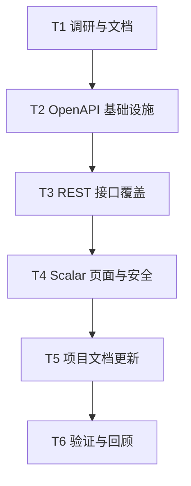

# 任务列表 — API 文档支持

**关联需求**: [`requirements.md`](./requirements.md)
**估算量级**: 中 (审核轮数：5)
**总体进度**: ✅ 6 / 6

## 状态图例

| Emoji | 状态   | 含义            |
| ----- | ------ | --------------- |
| ⏳    | 待开始 | 还没开始        |
| 🚧    | 进行中 | 当前正在做      |
| ✅    | 已完成 | 自检通过        |
| ⚠️    | 阻塞中 | 等待外部决策    |
| 🔍    | 待审核 | 做完等待 review |

## 里程碑依赖图

## Milestone 1: 方案与任务

**目标**: 明确实现范围和维护策略
**依赖**: 无
**状态**: ✅

### Task 1.1 ✅ 建立需求与任务文档

**描述**: 在 `docs/exec-plans/api-docs-support/` 记录需求、风险、任务和验收标准。
**依赖**: 无
**阻塞**: T2.1
**验收**:

- [x] 需求文档存在且覆盖目标/风险/架构。
- [x] 任务文档存在且状态可追踪。

#### 备注

- 🐛 **遇到的问题**: 无。
- 🔧 **最终实现逻辑**: 新增 requirements/tasks 作为本功能开发入口，并在交付后更新状态。
- 🎯 **关键决策**: 采用手写 OpenAPI spec + Scalar 页面，避免一次性重写所有路由。

## Milestone 2: OpenAPI 基础设施

**目标**: 提供 OpenAPI JSON 和共享 schema 工具
**依赖**: T1.1
**状态**: ✅

### Task 2.1 ✅ 新增 OpenAPI 文档模块

**描述**: 新增 `server/src/docs/openapi.ts`，定义统一 components、tags 和 paths。
**依赖**: T1.1
**阻塞**: T3.1
**验收**:

- [x] OpenAPI JSON 结构合法。
- [x] 公共 schema 覆盖用户、配额、任务、会话、图片、错误。

#### 备注

- 🐛 **遇到的问题**: OpenAPI 体量较大，采用集中 spec + helper 函数降低重复。
- 🔧 **最终实现逻辑**: `server/src/docs/openapi.ts` 定义 OpenAPI 3.1 文档、components、securitySchemes 和 paths。
- 🎯 **关键决策**: 先手写权威 spec，后续可逐步迁移到声明式 route 生成。

## Milestone 3: 接口覆盖

**目标**: 覆盖当前 REST API
**依赖**: T2.1
**状态**: ✅

### Task 3.1 ✅ 补齐所有当前路径的描述

**描述**: 为健康检查、认证、当前用户、生图、会话、历史、上传、公告、admin、sysadmin 等接口补齐功能、参数、成功响应、错误响应。
**依赖**: T2.1
**阻塞**: T4.1
**验收**:

- [x] `server/src/routes/` 当前 REST 路径全部在 OpenAPI paths 中出现。
- [x] 每个操作有精确 summary/description。
- [x] 每个操作有成功响应和常见错误响应。

#### 备注

- 🐛 **遇到的问题**: `POST /api/auth/password/change` 容易被误写为 `/password`，已按实际路由修正。
- 🔧 **最终实现逻辑**: 覆盖 58 个 path / 74 个 operation，包含请求参数、请求体、成功响应、错误响应、角色与 CSRF 说明。
- 🎯 **关键决策**: 将 `/ws/task/{id}` 与兼容存在的 `/api/ws/task/{id}` 都纳入文档。

## Milestone 4: 页面与安全

**目标**: 提供可浏览的文档页面
**依赖**: T3.1
**状态**: ✅

### Task 4.1 ✅ 挂载 docs 路由与 CSP

**描述**: 新增 `/api/openapi.json` 和 `/api/docs`，生产环境要求 sysadmin，docs 路径 CSP 允许 Scalar。
**依赖**: T3.1
**阻塞**: T5.1
**验收**:

- [x] 本地可打开 `/api/docs`。
- [x] `/api/openapi.json` 返回 JSON。
- [x] 主应用 CSP 不被整体放宽。

#### 备注

- 🐛 **遇到的问题**: Scalar 页面需要 CDN 脚本和 inline 初始化脚本，原 CSP 会阻断。
- 🔧 **最终实现逻辑**: `server/src/routes/docs.ts` 挂载 `/api/docs` 和 `/api/openapi.json`；`security.ts` 仅对 `/api/docs` 使用 docs 专用 CSP。
- 🎯 **关键决策**: production 环境要求 sysadmin 登录，dev 环境公开访问。

## Milestone 5: 项目文档

**目标**: 让维护者知道文档地址和更新位置
**依赖**: T4.1
**状态**: ✅

### Task 5.1 ✅ 更新 README/docs 索引

**描述**: 在 README、docs/API 或 docs/README 中记录本地文档 URL 与维护入口。
**依赖**: T4.1
**阻塞**: T6.1
**验收**:

- [x] 文档索引包含 API Reference 地址。
- [x] API 文档维护位置清楚。

#### 备注

- 🐛 **遇到的问题**: `docs/API.md` 中部分旧路径名称已过时，已顺手修正为当前路由。
- 🔧 **最终实现逻辑**: 更新 README、docs/README、docs/API，记录 `/api/docs`、`/api/openapi.json` 和 spec 维护位置。
- 🎯 **关键决策**: 保留 Markdown API 概览作为人工入口，详细契约以 OpenAPI 为准。

## Milestone 6: 验证与回顾

**目标**: 类型检查、spec 检查和最终回顾
**依赖**: T5.1
**状态**: ✅

### Task 6.1 ✅ 验证实现

**描述**: 运行 server typecheck，并检查旧路由和 OpenAPI paths 对齐。
**依赖**: T5.1
**阻塞**: 无
**验收**:

- [x] `pnpm -F server typecheck` 通过。
- [x] 无明显路径遗漏。

#### 备注

- 🐛 **遇到的问题**: 初次类型检查发现重复响应码和 production docs middleware 返回类型问题，已修复。
- 🔧 **最终实现逻辑**: 通过 typecheck、lint、Worker dry-run build、本地 curl 验证；OpenAPI JSON 有 58 个 paths / 74 个 operations，所有 operation 均有 summary、description、responses。
- 🎯 **关键决策**: 实测 docs HTML 是否包含页面标题和 `/api/openapi.json`，并检查 CSP 只对 `/api/docs` 放宽。

## 进度总览

| 里程碑   | 任务             | 完成  | 总数  | 状态   |
| -------- | ---------------- | ----- | ----- | ------ |
| M1       | 方案与任务       | 1     | 1     | ✅     |
| M2       | OpenAPI 基础设施 | 1     | 1     | ✅     |
| M3       | 接口覆盖         | 1     | 1     | ✅     |
| M4       | 页面与安全       | 1     | 1     | ✅     |
| M5       | 项目文档         | 1     | 1     | ✅     |
| M6       | 验证与回顾       | 1     | 1     | ✅     |
| **总计** |                  | **6** | **6** | **✅** |

## 变更记录

| 日期       | 变更           |
| ---------- | -------------- |
| 2026-04-30 | 初稿，6 个任务 |
| 2026-04-30 | 完成实现与验证 |
