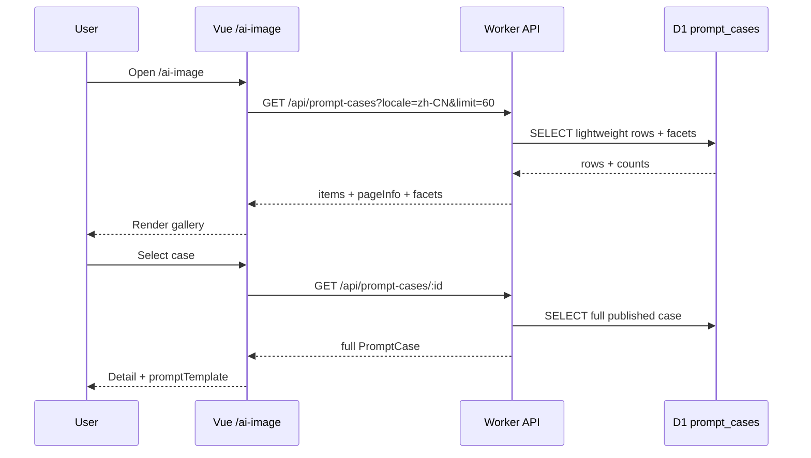

# 案例库分页与详情懒加载需求

**版本**: v0.1  
**日期**: 2026-05-07  
**作者**: Gao + AI  
**状态**: 草稿  
**关联任务列表**: [`tasks.md`](./tasks.md)

---

## 1. 背景

AI 图像生成页的案例库已经从最初的几十条增长到 1000+ 条。当前用户端接口 [`server/src/routes/promptCases.ts`](../../../server/src/routes/promptCases.ts) 通过 `GET /api/prompt-cases` 一次返回完整 DTO，包含 `promptTemplate`、来源字段、标签、缩略图 URL 等全部信息；前端 [`web/src/views/ai-image/useAiImageCases.ts`](../../../web/src/views/ai-image/useAiImageCases.ts) 再把所有案例放进内存中做分类、尺寸、模式和关键词筛选。

实测全量响应约 270KB，接口耗时约 1.4 秒。这个体量当前还能使用，但随着案例继续增长，首屏加载、移动端网络、内存占用和筛选计算都会线性变差。更关键的是，首屏案例卡片并不需要完整 prompt 模板，只有用户点开详情或应用案例时才需要 `promptTemplate`。

本需求的目标不是把体验改成传统分页表格，而是把案例库改成适合浏览型素材库的加载模型：列表轻量化、服务端筛选、加载更多或无限滚动、详情按需获取。

---

## 2. 目标

### 2.1 范围内

- 将用户端案例列表接口从全量完整 DTO 调整为轻量列表响应。
- 支持 `limit`、`cursor`、`category`、`mode`、`size`、`locale`、`featured`、`search` 等服务端筛选参数。
- 新增用户端案例详情接口，通过 `id` 获取完整案例，包括 `promptTemplate`。
- 前端案例库改为首屏加载一页，后续通过“加载更多”或滚动触底继续请求。
- 前端筛选、搜索、分类切换改为服务端请求，并避免只基于当前页推导全局分类。
- 保留当前“预览案例、选中案例、应用 prompt、Prompt 助手上下文”的产品行为。
- 保持 sysadmin 管理端可继续使用完整列表，是否分页另列为后续优化。

### 2.2 范围外

- 本期不重做案例卡片视觉设计。
- 本期不新增推荐排序、向量搜索、相似案例推荐。
- 本期不改变案例采集、压缩、R2 上传和 seed 流程。
- 本期不改变 `prompt_cases` 表的核心字段语义；如需索引可通过迁移补充。
- 本期不强制改造 sysadmin 案例管理页，除非共享类型调整导致必要适配。

### 2.3 成功标准

- 用户进入 `/ai-image` 后，首个 `GET /api/prompt-cases` 响应体目标小于 80KB。
- 用户端案例列表首屏接口 p95 目标小于 500ms，移动弱网下不阻塞主操作区渲染。
- 用户能继续按分类、模式、尺寸、关键词筛选案例，且筛选结果来自服务端全量数据。
- 用户点击或应用案例时能拿到完整 prompt，行为与当前版本一致。
- 数据库本地和远程均能通过测试或手动查询验证分页顺序稳定、无重复、无漏项。

---

## 3. 用户场景

### 3.1 首次进入 AI 图像生成页

**角色**: 已登录用户  
**前置条件**: 用户有权限访问 `/ai-image`，案例库有已发布案例。

**步骤**:

1. 用户进入 `/ai-image`。
2. 前端请求当前语言下的案例列表第一页。
3. 系统展示案例卡片、分类筛选、模式筛选和加载状态。
4. 用户可以先浏览第一页，不需要等待全部 1000+ 条加载完。

**预期结果**: 首屏案例区域尽快可交互，接口返回轻量列表，不包含完整 prompt 模板。

### 3.2 用户筛选案例

**角色**: 已登录用户  
**前置条件**: 案例列表已加载第一页。

**步骤**:

1. 用户点击某个分类、模式或尺寸筛选。
2. 前端重置当前列表和 cursor，带筛选参数请求服务端。
3. 服务端返回该筛选条件下的第一页和下一页 cursor。
4. 用户继续滚动或点击加载更多。

**预期结果**: 筛选结果基于全量案例库，而不是只筛当前已经加载的页。

### 3.3 用户搜索案例

**角色**: 已登录用户  
**前置条件**: 用户在案例搜索框输入关键词。

**步骤**:

1. 用户输入关键词。
2. 前端 debounce 后请求服务端搜索。
3. 服务端在标题、摘要、标签和分类中搜索。
4. 前端展示搜索结果第一页。

**预期结果**: 搜索不会一次拉全量数据到前端；快速连续输入时旧请求结果不会覆盖新请求。

### 3.4 用户查看详情并应用 prompt

**角色**: 已登录用户  
**前置条件**: 用户已看到案例卡片。

**步骤**:

1. 用户点击案例卡片。
2. 前端若未缓存详情，则请求 `GET /api/prompt-cases/:id`。
3. 详情面板展示完整 prompt、来源、标签和图片。
4. 用户点击“使用案例提示词”。

**预期结果**: 应用 prompt 的行为与当前版本一致，`caseId` 埋点和生成提交上下文不丢失。

---

## 4. 功能需求

### F1: 轻量案例列表 DTO

**描述**: 用户端列表接口默认不返回 `promptTemplate` 等详情字段，只返回卡片展示与筛选需要的数据。

**建议字段**:

| 字段              | 说明             |
| ----------------- | ---------------- |
| `id`              | 案例 ID          |
| `title`           | 标题             |
| `category`        | 分类             |
| `modes`           | 支持模式         |
| `recommendedSize` | 推荐比例         |
| `tags`            | 标签             |
| `promptSummary`   | 摘要             |
| `thumbnailUrl`    | 缩略图           |
| `sourceAuthor`    | 卡片底部可选展示 |
| `sourceRepo`      | 卡片底部可选展示 |
| `sourceLicense`   | 兜底展示         |
| `featured`        | 是否精选         |
| `sortOrder`       | 排序             |
| `locale`          | 语言             |

**验收标准**:

- 列表接口响应不包含 `promptTemplate`。
- 当前 `PromptCaseGallery` 卡片展示不缺字段。
- 类型层区分 `PromptCaseListItem` 和完整 `PromptCase`。

### F2: 游标分页列表接口

**描述**: `GET /api/prompt-cases` 支持分页与服务端筛选。

**查询参数**:

| 参数       | 类型                         | 默认    | 说明                        |
| ---------- | ---------------------------- | ------- | --------------------------- |
| `locale`   | `zh-CN` / `en-US`            | `zh-CN` | 当前 UI 语言                |
| `limit`    | number                       | `60`    | 单页数量，建议范围 `1..100` |
| `cursor`   | string                       | 无      | 上一页返回的游标            |
| `category` | string                       | 无      | 分类筛选                    |
| `mode`     | `image2image` / `text2image` | 无      | 模式筛选                    |
| `size`     | string                       | 无      | 推荐尺寸筛选                |
| `featured` | `0` / `1`                    | 无      | 精选筛选                    |
| `search`   | string                       | 无      | 标题、摘要、标签、分类搜索  |

**响应结构建议**:

```json
{
  "items": [],
  "pageInfo": {
    "nextCursor": "opaque-string-or-null",
    "hasMore": true,
    "limit": 60
  },
  "facets": {
    "categories": [{ "value": "人像与摄影", "count": 148 }],
    "sizes": [{ "value": "1:1", "count": 320 }],
    "modes": [{ "value": "image2image", "count": 900 }]
  }
}
```

**验收标准**:

- 同一筛选条件下连续翻页无重复、无漏项。
- cursor 为不暴露内部 SQL 细节的不透明字符串。
- 搜索和筛选参数改变时旧 cursor 不可复用或会被安全忽略。
- 返回结果排序与当前体验一致：`featured desc`、`sortOrder asc`、`updatedAt desc`、`id` 兜底稳定排序。

### F3: 案例详情接口

**描述**: 新增 `GET /api/prompt-cases/:id`，只返回已发布且当前用户可访问的完整案例。

**行为**:

- 校验登录态。
- 只返回 `status = published`。
- 可选校验 `locale`，如果传入 locale 且案例不匹配，可返回 404 或忽略 locale；实现前需拍板。
- 返回完整 `PromptCase`，包含 `promptTemplate` 和来源字段。

**验收标准**:

- 未登录用户无法访问。
- draft/hidden/archived 案例对用户端详情接口不可见。
- 前端应用 prompt 时使用详情接口返回的 `promptTemplate`。

### F4: Facets / 筛选元数据

**描述**: 分页后，前端不能再从当前页推导完整分类和尺寸列表。列表接口应返回与当前基础条件匹配的 facets。

**建议规则**:

- `categories` 受 `locale`、`mode`、`search` 等条件影响，但不受当前 `category` 自身影响，方便用户切换分类。
- `sizes` 受 `locale`、`category`、`mode`、`search` 影响。
- `modes` 受 `locale`、`category`、`size`、`search` 影响。

**验收标准**:

- 首屏就能展示全局分类按钮，而不是只展示第一页出现的分类。
- 切换筛选后 count 与列表结果一致。

### F5: 前端加载模型

**描述**: [`useAiImageCases.ts`](../../../web/src/views/ai-image/useAiImageCases.ts) 从一次性全量加载改为分页状态机。

**状态建议**:

- `items`
- `pageInfo`
- `facets`
- `loadingInitial`
- `loadingMore`
- `detailLoading`
- `detailsById`
- `requestSeq` 或 AbortController

**验收标准**:

- 初始加载、筛选加载、加载更多、详情加载状态互不打架。
- 快速切换 locale/search/category 时，旧响应不会覆盖新状态。
- 详情已加载后再次点击同一案例不重复请求。

### F6: Prompt 应用兼容

**描述**: 当前 `promptCaseApplyResult` 依赖 `item.promptTemplate`。分页改造后，列表项没有 `promptTemplate`，应用案例前必须确保详情已加载。

**验收标准**:

- 用户点击“使用案例提示词”时，如果详情未加载，按钮显示加载状态或先自动加载。
- 详情加载失败时不清空用户已有 prompt。
- `caseContextId`、`finalPromptSource`、生成提交 `caseId` 保持当前语义。

### F7: 测试与回归

**描述**: 覆盖后端分页、前端状态机和关键交互。

**验收标准**:

- 后端测试覆盖 cursor 翻页、筛选、搜索、详情权限。
- 前端测试覆盖初始加载、筛选重置、加载更多、详情懒加载、应用 prompt。
- 现有 `promptCaseSelection` 纯逻辑测试按新类型更新。

---

## 5. 非功能需求

### 5.1 性能

- 首屏列表接口响应体目标小于 80KB。
- 默认 `limit = 60`，最大 `limit = 100`。
- D1 查询避免全表扫描扩大化；必要时为 `locale/status/category/sortOrder/updatedAt` 等组合补索引。
- 搜索保持简单 LIKE 搜索即可；若未来案例达到 10000+ 再评估全文索引或外部搜索。

### 5.2 安全

- 用户端接口继续使用 `requireAuth`。
- 详情接口不能泄漏 draft/hidden/archived 案例。
- cursor 必须做签名或编码校验，不能让用户注入 SQL 片段。
- 搜索、分类、尺寸参数继续走 Zod 校验，长度上限保持保守。

### 5.3 可靠性

- 服务端返回统一错误格式 `{ error: { code, message, details } }`。
- 前端网络失败时显示 toast，但不破坏已有列表和 prompt。
- 加载更多失败时允许用户重试当前页。

### 5.4 可访问性

- “加载更多”按钮必须键盘可达。
- 无限滚动如果实现，仍需保留可点击按钮作为可访问兜底。
- 加载状态对屏幕阅读器可感知，避免只靠视觉 spinner。

### 5.5 国际化

- `locale` 继续跟随 `useUiStore().locale`。
- locale 切换时清空当前分页列表并重新请求。
- 已应用的 prompt 是否随 locale 切换清空，沿用当前逻辑：若 case 不再可用且 prompt 来源为 case，则清理。

### 5.6 可观测性

- 保留现有 `prompt_case_selected`、助手开始、生成提交等事件。
- 可选新增客户端性能埋点：列表首屏加载耗时、详情加载耗时、加载更多失败次数。

---

## 6. 技术方案

### 6.1 后端模块

| 模块                                                                            | 调整                                          |
| ------------------------------------------------------------------------------- | --------------------------------------------- |
| [`server/src/lib/promptCases.ts`](../../../server/src/lib/promptCases.ts)       | 增加轻量 DTO、分页查询、详情查询、facets 查询 |
| [`server/src/routes/promptCases.ts`](../../../server/src/routes/promptCases.ts) | 扩展查询 schema，新增 `/:id` 路由             |
| [`server/src/db/schema.ts`](../../../server/src/db/schema.ts)                   | 如性能需要，增加索引迁移                      |
| [`server/src/docs/openapi.ts`](../../../server/src/docs/openapi.ts)             | 更新用户端案例接口文档                        |

### 6.2 前端模块

| 模块                                                                                                    | 调整                                    |
| ------------------------------------------------------------------------------------------------------- | --------------------------------------- |
| [`web/src/types/promptCases.ts`](../../../web/src/types/promptCases.ts)                                 | 增加 `PromptCaseListItem`、分页响应类型 |
| [`web/src/api/promptCases.ts`](../../../web/src/api/promptCases.ts)                                     | 增加分页参数、详情 API                  |
| [`web/src/views/ai-image/useAiImageCases.ts`](../../../web/src/views/ai-image/useAiImageCases.ts)       | 改为分页状态机与详情缓存                |
| [`web/src/views/ai-image/PromptCaseGallery.vue`](../../../web/src/views/ai-image/PromptCaseGallery.vue) | 增加加载更多状态与事件                  |
| [`web/src/views/ai-image/PromptCaseDetail.vue`](../../../web/src/views/ai-image/PromptCaseDetail.vue)   | 支持详情加载中/失败状态                 |

### 6.3 架构图



### 6.4 Cursor 方案

推荐使用基于排序键的 keyset pagination，而不是 offset pagination。

排序键：

1. `featured desc`
2. `sortOrder asc`
3. `updatedAt desc`
4. `id asc`

cursor 内容可以包含上一页最后一条的这些字段，经 JSON 序列化后 base64url 编码。若担心篡改，可追加 HMAC 签名；没有签名时也必须严格解析和类型校验，不拼接 SQL 字符串。

---

## 7. 数据库与迁移

初步可先不改表结构，先测量 D1 查询性能。如果分页接口仍慢，再考虑迁移增加索引。

候选索引：

- `(status, locale, featured, sort_order, updated_at)`
- `(status, locale, category, featured, sort_order, updated_at)`
- `(status, locale, recommended_size)`

注意：`modes` 和 `tags` 当前是 JSON 字符串，LIKE 查询可继续使用；若未来筛选压力明显，再考虑规范化表或冗余索引字段。

---

## 8. 风险

| 风险                           | 概率 | 影响 | 缓解方案                                           |
| ------------------------------ | ---- | ---- | -------------------------------------------------- |
| 前端状态机复杂度上升           | 中   | 中   | 先写组合函数测试，再改组件                         |
| 详情懒加载导致应用 prompt 延迟 | 中   | 中   | 选中时预取详情；应用按钮显示加载态                 |
| cursor 排序边界出错            | 中   | 高   | 后端测试覆盖重复 sortOrder、同 updatedAt、最后一页 |
| facets count 查询拖慢接口      | 中   | 中   | 先测量；必要时拆成单独 `/facets` 或缓存            |
| sysadmin 与用户端类型混用      | 中   | 中   | 明确 `PromptCaseListItem` 与 `PromptCase` 两套类型 |

---

## 9. 开放问题

- [ ] 用户端详情接口传入 locale 不匹配时，是返回 404，还是允许通过 id 打开任意 locale 案例？
- [ ] 首屏默认数量采用 48、60 还是 72？需要结合当前卡片网格和常见屏幕验证。
- [ ] 搜索是否只搜标题、摘要、标签、分类，还是包含完整 promptTemplate？建议本期不搜 promptTemplate，避免详情字段拖入列表查询。
- [ ] 分类 facets 是否需要显示 count？如果 UI 暂不展示 count，仍可后端返回以备后续使用。
- [ ] 是否需要把 sysadmin 列表也一起分页？建议后续单独做，避免扩大本期范围。

---

## 10. 验收与验证命令

建议实现期间使用：

```bash
pnpm -F server test
pnpm -F server lint
pnpm -F server typecheck
pnpm -F web test
pnpm -F web lint
pnpm -F web typecheck
```

手动验证：

- 登录后打开 `/ai-image`，观察首屏案例列表接口大小和耗时。
- 切换 locale、分类、模式、尺寸和搜索关键词。
- 连续点击加载更多直到最后一页，确认无重复和无空洞。
- 点开案例详情并应用 prompt，确认生成提交携带原 caseId 语义。

---

## 11. 参考资料

- 当前用户端路由：[`server/src/routes/promptCases.ts`](../../../server/src/routes/promptCases.ts)
- 当前领域逻辑：[`server/src/lib/promptCases.ts`](../../../server/src/lib/promptCases.ts)
- 当前前端控制器：[`web/src/views/ai-image/useAiImageCases.ts`](../../../web/src/views/ai-image/useAiImageCases.ts)
- 当前卡片列表：[`web/src/views/ai-image/PromptCaseGallery.vue`](../../../web/src/views/ai-image/PromptCaseGallery.vue)

---

## 变更历史

| 日期       | 版本 | 变更                                           |
| ---------- | ---- | ---------------------------------------------- |
| 2026-05-07 | v0.1 | 初稿，定义轻量列表、分页、详情懒加载与任务拆解 |
