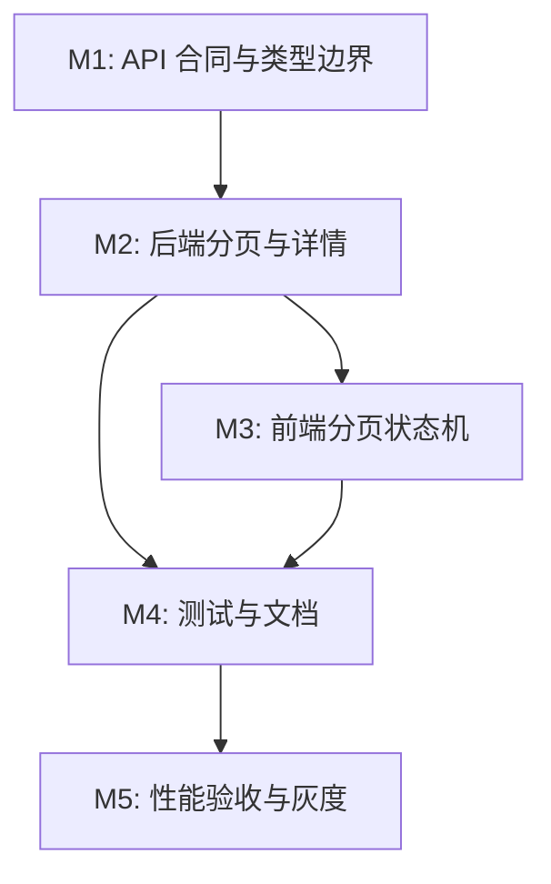

# 案例库分页与详情懒加载任务列表

**关联需求**: [`requirements.md`](./requirements.md)  
**估算量级**: 中型，约 14 个任务，影响前后端与 API 文档  
**总体进度**: 0 / 14  
**状态**: TODO

---

## 状态图例

| 状态     | 含义                               |
| -------- | ---------------------------------- |
| TODO     | 待开始                             |
| DOING    | 进行中                             |
| REVIEW   | 实现完成，待人工或最终审核         |
| DONE     | 已完成并通过验证                   |
| BLOCKED  | 被外部决策或不可自行解决的问题阻塞 |
| DEFERRED | 有意延后，不属于当前批次           |

---

## 里程碑依赖图

---

## Milestone 1: API 合同与类型边界

**目标**: 先把列表项、详情项、分页响应、facets 的合同定清楚，避免前后端互相猜字段。  
**依赖**: 无  
**状态**: TODO

### PCP-001 TODO 定义用户端分页 API 合同

**描述**: 明确 `GET /api/prompt-cases` 的查询参数、响应结构、错误格式与默认值。

**依赖**: 无  
**阻塞**: PCP-003, PCP-004, PCP-008  
**预估**: 1h

**关联文件 / 模块**:

- [`docs/exec-plans/prompt-cases-pagination/requirements.md`](./requirements.md)
- [`server/src/routes/promptCases.ts`](../../../server/src/routes/promptCases.ts)
- [`server/src/docs/openapi.ts`](../../../server/src/docs/openapi.ts)

**验收**:

- [ ] 参数包含 `limit`、`cursor`、`category`、`mode`、`size`、`locale`、`featured`、`search`。
- [ ] 响应包含 `items`、`pageInfo`、`facets`。
- [ ] 默认 `limit`、最大 `limit` 和 cursor 失效行为有明确说明。

#### 备注

- 遇到的问题:
- 最终实现逻辑:
- 关键决策:

---

### PCP-002 TODO 拆分前端类型

**描述**: 在前端类型中拆出 `PromptCaseListItem`、`PromptCasePageInfo`、`PromptCaseFacets`，保留完整 `PromptCase` 给详情与 sysadmin 使用。

**依赖**: PCP-001  
**阻塞**: PCP-008, PCP-009, PCP-010  
**预估**: 1.5h

**关联文件 / 模块**:

- [`web/src/types/promptCases.ts`](../../../web/src/types/promptCases.ts)
- [`web/src/api/promptCases.ts`](../../../web/src/api/promptCases.ts)

**验收**:

- [ ] 列表项类型不包含 `promptTemplate`。
- [ ] 完整详情类型仍兼容 sysadmin 表单和详情面板。
- [ ] TypeScript 能明确阻止把轻量列表项直接传给应用 prompt 逻辑。

#### 备注

- 遇到的问题:
- 最终实现逻辑:
- 关键决策:

---

## Milestone 2: 后端分页与详情

**目标**: Worker API 支持轻量分页列表、详情查询和 facets。  
**依赖**: M1  
**状态**: TODO

### PCP-003 TODO 增加后端轻量 DTO 与详情 DTO

**描述**: 在领域层拆分 `PromptCaseListItemDto` 与完整 `PromptCaseDto`，避免用户端列表返回 prompt 模板。

**依赖**: PCP-001  
**阻塞**: PCP-004, PCP-005  
**预估**: 2h

**关联文件 / 模块**:

- [`server/src/lib/promptCases.ts`](../../../server/src/lib/promptCases.ts)

**验收**:

- [ ] `promptCaseToListItemDto` 不返回 `promptTemplate`。
- [ ] `promptCaseToDto` 继续用于详情和 sysadmin。
- [ ] 公开类型命名清楚，避免路由层误用。

#### 备注

- 遇到的问题:
- 最终实现逻辑:
- 关键决策:

---

### PCP-004 TODO 实现 keyset pagination 查询

**描述**: 用稳定排序键实现分页查询，避免 offset 在 D1 数据增长后性能和重复问题。

**依赖**: PCP-001, PCP-003  
**阻塞**: PCP-006, PCP-007, PCP-011  
**预估**: 4h

**关联文件 / 模块**:

- [`server/src/lib/promptCases.ts`](../../../server/src/lib/promptCases.ts)
- [`server/src/routes/promptCases.ts`](../../../server/src/routes/promptCases.ts)

**验收**:

- [ ] 默认按 `featured desc, sortOrder asc, updatedAt desc, id asc` 排序。
- [ ] `nextCursor` 能正确翻到下一页。
- [ ] 筛选条件变化时 cursor 不会导致 SQL 错误或越权数据。
- [ ] 最后一页返回 `hasMore = false` 和 `nextCursor = null`。

#### 备注

- 遇到的问题:
- 最终实现逻辑:
- 关键决策:

---

### PCP-005 TODO 实现案例详情接口

**描述**: 新增 `GET /api/prompt-cases/:id`，返回完整已发布案例。

**依赖**: PCP-003  
**阻塞**: PCP-010, PCP-011  
**预估**: 2h

**关联文件 / 模块**:

- [`server/src/routes/promptCases.ts`](../../../server/src/routes/promptCases.ts)
- [`server/src/lib/promptCases.ts`](../../../server/src/lib/promptCases.ts)

**验收**:

- [ ] 仅登录用户可访问。
- [ ] draft、hidden、archived 对用户端不可见。
- [ ] 不存在或不可见案例返回统一 NOT_FOUND。

#### 备注

- 遇到的问题:
- 最终实现逻辑:
- 关键决策:

---

### PCP-006 TODO 实现 facets 查询

**描述**: 为分页列表返回全局分类、尺寸和模式筛选元数据，避免前端从当前页推导。

**依赖**: PCP-004  
**阻塞**: PCP-009  
**预估**: 3h

**关联文件 / 模块**:

- [`server/src/lib/promptCases.ts`](../../../server/src/lib/promptCases.ts)

**验收**:

- [ ] `facets.categories` 覆盖当前基础条件下的全部分类。
- [ ] `facets.sizes` 和 `facets.modes` count 与筛选语义一致。
- [ ] facets 查询不会返回 archived/hidden/draft。

#### 备注

- 遇到的问题:
- 最终实现逻辑:
- 关键决策:

---

### PCP-007 TODO 评估并补充 D1 索引

**描述**: 基于远程 D1 数据量和查询计划，决定是否增加索引迁移。

**依赖**: PCP-004, PCP-006  
**阻塞**: PCP-013  
**预估**: 2h

**关联文件 / 模块**:

- [`server/src/db/schema.ts`](../../../server/src/db/schema.ts)
- `server/src/db/migrations/`
- [`docs/DATABASE.md`](../../DATABASE.md)

**验收**:

- [ ] 有本地或远程查询耗时对比。
- [ ] 如需索引，生成并提交 Drizzle migration。
- [ ] 迁移文档或任务备注记录索引理由。

#### 备注

- 遇到的问题:
- 最终实现逻辑:
- 关键决策:

---

## Milestone 3: 前端分页状态机

**目标**: `/ai-image` 案例库从全量内存筛选迁移到分页加载、服务端筛选和详情缓存。  
**依赖**: M2  
**状态**: TODO

### PCP-008 TODO 更新 API 客户端

**描述**: `listPublishedPromptCases` 支持分页参数和响应结构，新增 `getPublishedPromptCase`。

**依赖**: PCP-001, PCP-002, PCP-004, PCP-005  
**阻塞**: PCP-009, PCP-010  
**预估**: 2h

**关联文件 / 模块**:

- [`web/src/api/promptCases.ts`](../../../web/src/api/promptCases.ts)

**验收**:

- [ ] 列表 API 返回分页响应，而不是数组。
- [ ] 详情 API 返回完整 `PromptCase`。
- [ ] 现有 sysadmin API 不受影响。

#### 备注

- 遇到的问题:
- 最终实现逻辑:
- 关键决策:

---

### PCP-009 TODO 改造 useAiImageCases 分页状态机

**描述**: 把当前一次性 `load()` 改为初始加载、筛选重载、加载更多、详情缓存四类状态。

**依赖**: PCP-006, PCP-008  
**阻塞**: PCP-010, PCP-012  
**预估**: 5h

**关联文件 / 模块**:

- [`web/src/views/ai-image/useAiImageCases.ts`](../../../web/src/views/ai-image/useAiImageCases.ts)
- [`web/src/views/ai-image/promptCaseSelection.ts`](../../../web/src/views/ai-image/promptCaseSelection.ts)

**验收**:

- [ ] `load()` 只加载第一页。
- [ ] `loadMore()` 追加下一页并防止重复请求。
- [ ] category、mode、size、search、locale 改变时重置分页。
- [ ] 旧请求不会覆盖新请求结果。
- [ ] 已加载详情按 id 缓存。

#### 备注

- 遇到的问题:
- 最终实现逻辑:
- 关键决策:

---

### PCP-010 TODO 改造详情和应用 prompt 流程

**描述**: 列表项不再包含 `promptTemplate` 后，详情面板和应用 prompt 前需要确保完整案例已加载。

**依赖**: PCP-005, PCP-008, PCP-009  
**阻塞**: PCP-012  
**预估**: 4h

**关联文件 / 模块**:

- [`web/src/views/ai-image/PromptCaseDetail.vue`](../../../web/src/views/ai-image/PromptCaseDetail.vue)
- [`web/src/views/ai-image/AiImageGeneration.vue`](../../../web/src/views/ai-image/AiImageGeneration.vue)
- [`web/src/views/ai-image/AiImagePromptPanel.vue`](../../../web/src/views/ai-image/AiImagePromptPanel.vue)

**验收**:

- [ ] 点击案例后详情区域可显示加载态。
- [ ] 应用 prompt 前能拿到完整 `promptTemplate`。
- [ ] 详情失败不会清空用户 prompt。
- [ ] 生成提交和事件埋点仍带正确 case 上下文。

#### 备注

- 遇到的问题:
- 最终实现逻辑:
- 关键决策:

---

### PCP-011 TODO 更新案例列表 UI 加载更多

**描述**: `PromptCaseGallery` 增加加载更多入口，并支持初始加载、追加加载、空状态和错误重试。

**依赖**: PCP-009  
**阻塞**: PCP-012, PCP-013  
**预估**: 3h

**关联文件 / 模块**:

- [`web/src/views/ai-image/PromptCaseGallery.vue`](../../../web/src/views/ai-image/PromptCaseGallery.vue)
- [`web/src/views/ai-image/AiImageGeneration.vue`](../../../web/src/views/ai-image/AiImageGeneration.vue)

**验收**:

- [ ] 有可点击、键盘可达的“加载更多”入口。
- [ ] 追加加载不重排已加载卡片。
- [ ] 最后一页不再显示加载更多。
- [ ] 加载更多失败可重试。

#### 备注

- 遇到的问题:
- 最终实现逻辑:
- 关键决策:

---

## Milestone 4: 测试与文档

**目标**: 保证分页、详情懒加载和筛选语义不会回归。  
**依赖**: M2, M3  
**状态**: TODO

### PCP-012 TODO 增加后端和前端测试

**描述**: 覆盖 API、组合函数状态机和关键组件交互。

**依赖**: PCP-004, PCP-005, PCP-009, PCP-010, PCP-011  
**阻塞**: PCP-013  
**预估**: 5h

**关联文件 / 模块**:

- `server/src/**/*.test.ts`
- [`web/src/views/ai-image/useAiImageCases.test.ts`](../../../web/src/views/ai-image/useAiImageCases.test.ts)
- [`web/src/views/ai-image/AiImageGeneration.test.ts`](../../../web/src/views/ai-image/AiImageGeneration.test.ts)

**验收**:

- [ ] 后端测试覆盖分页、筛选、搜索、详情权限。
- [ ] 前端测试覆盖筛选重载、加载更多、详情缓存、应用 prompt。
- [ ] 旧测试按新类型更新并通过。

#### 备注

- 遇到的问题:
- 最终实现逻辑:
- 关键决策:

---

### PCP-013 TODO 更新 API / 前端 / 验收文档

**描述**: 将新接口和新加载模型写入项目文档。

**依赖**: PCP-001, PCP-012  
**阻塞**: PCP-014  
**预估**: 2h

**关联文件 / 模块**:

- [`docs/API.md`](../../API.md)
- [`docs/FRONTEND.md`](../../FRONTEND.md)
- [`docs/ACCEPTANCE.md`](../../ACCEPTANCE.md)
- [`server/src/docs/openapi.ts`](../../../server/src/docs/openapi.ts)

**验收**:

- [ ] API 文档列出分页参数、响应结构和详情接口。
- [ ] 前端文档说明案例库分页状态与详情缓存。
- [ ] 验收文档包含接口体积、加载更多和详情懒加载检查项。

#### 备注

- 遇到的问题:
- 最终实现逻辑:
- 关键决策:

---

## Milestone 5: 性能验收与灰度

**目标**: 用真实 1000+ 案例数据验证性能收益，确定是否需要进一步索引或缓存。  
**依赖**: M4  
**状态**: TODO

### PCP-014 TODO 性能测量与发布检查

**描述**: 在本地和远程环境测量列表接口大小、耗时、翻页正确性和详情加载体验。

**依赖**: PCP-007, PCP-012, PCP-013  
**阻塞**: 无  
**预估**: 3h

**关联文件 / 模块**:

- [`docs/ACCEPTANCE.md`](../../ACCEPTANCE.md)
- [`docs/OPERATIONS.md`](../../OPERATIONS.md)

**验收**:

- [ ] 记录改造前后首屏接口大小与耗时。
- [ ] 使用 1000+ 真实案例验证连续翻页无重复。
- [ ] 远程 D1 查询表现达到需求目标，或记录后续优化任务。
- [ ] 发布前回归 `/ai-image` 主要生成流程。

#### 备注

- 遇到的问题:
- 最终实现逻辑:
- 关键决策:

---

## 进度总览

| 里程碑 | 任务               | 完成 | 总数 | 状态 |
| ------ | ------------------ | ---- | ---- | ---- |
| M1     | API 合同与类型边界 | 0    | 2    | TODO |
| M2     | 后端分页与详情     | 0    | 5    | TODO |
| M3     | 前端分页状态机     | 0    | 4    | TODO |
| M4     | 测试与文档         | 0    | 2    | TODO |
| M5     | 性能验收与灰度     | 0    | 1    | TODO |
| 总计   |                    | 0    | 14   | TODO |

---

## 最终审核索引

| Round | 视角           | 状态 | 报告 |
| ----- | -------------- | ---- | ---- |
| 1     | 功能完整性     | TODO | -    |
| 2     | 类型与静态分析 | TODO | -    |
| 3     | 性能与 D1 查询 | TODO | -    |
| 4     | 安全与权限边界 | TODO | -    |
| 5     | UX 与可访问性  | TODO | -    |

---

## 变更记录

| 日期       | 变更                             |
| ---------- | -------------------------------- |
| 2026-05-07 | 初稿，拆分 5 个里程碑、14 个任务 |
