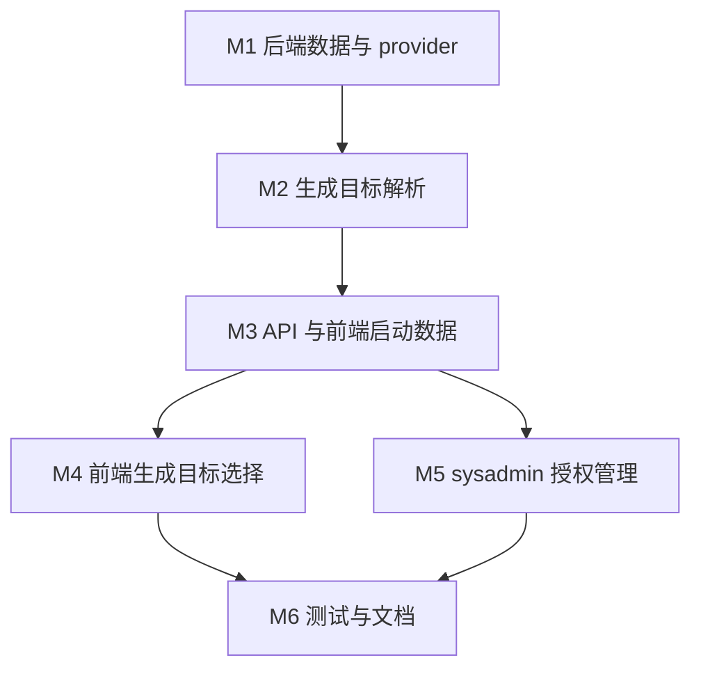

# 米醋 Grok 图像实验能力任务清单

## 依赖图

## 任务

- ✅ M1 后端数据与 provider
  - ✅ 新增 D1 schema/migration：`generation_feature_grants`
  - ✅ 新增内置 provider：`prv_micu_grok`
  - ✅ 新增 `micu_grok_images` adapter 与 registry
  - 备注：
    - 🐛
    - 🔧
    - 🎯

- ✅ M2 生成目标解析
  - ✅ 新增 `generationTargets` 领域模块
  - ✅ `createGenerateTask` 按 target 解析 key group
  - ✅ retry 沿用原任务 target
  - 备注：
    - 🐛
    - 🔧
    - 🎯

- ✅ M3 API 与管理端接口
  - ✅ `/api/me`、登录、刷新返回 `generationTargets`
  - ✅ `/api/sysadmin/generation-features` GET/PATCH
  - ✅ OpenAPI/API 文档更新
  - 备注：
    - 🐛
    - 🔧
    - 🎯

- ✅ M4 前端生成目标选择
  - ✅ auth store 增加 `generationTargets`
  - ✅ 工作台 ChatInput 支持 target 选择
  - ✅ AI 图像页支持 target 选择
  - 备注：
    - 🐛
    - 🔧
    - 🎯

- ✅ M5 sysadmin 授权管理
  - ✅ 系统设置页增加 Grok admin 授权区域
  - ✅ i18n 文案与 API 类型
  - 备注：
    - 🐛
    - 🔧
    - 🎯

- ✅ M6 测试、文档、验证
  - ✅ 后端单测与 API 权限测试
  - ✅ 前端单测
  - ✅ docs/API、FRONTEND、EXPERIMENTS、DATABASE 更新
  - ✅ lint/typecheck/test 验证
  - 备注：
    - 🐛
    - 🔧
    - 🎯
