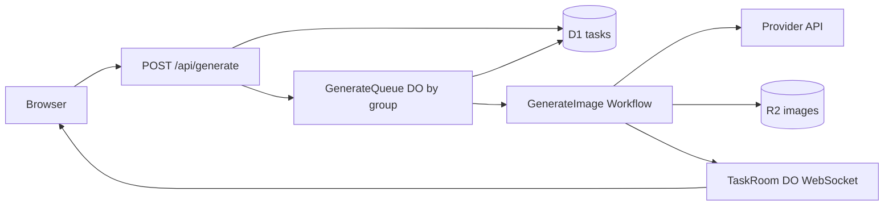
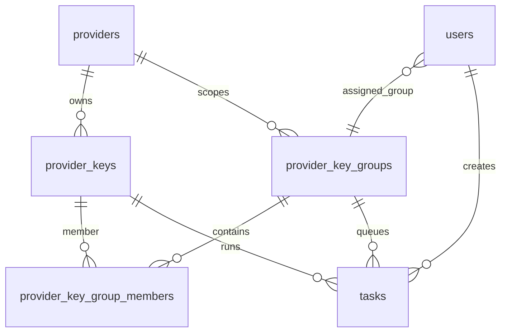
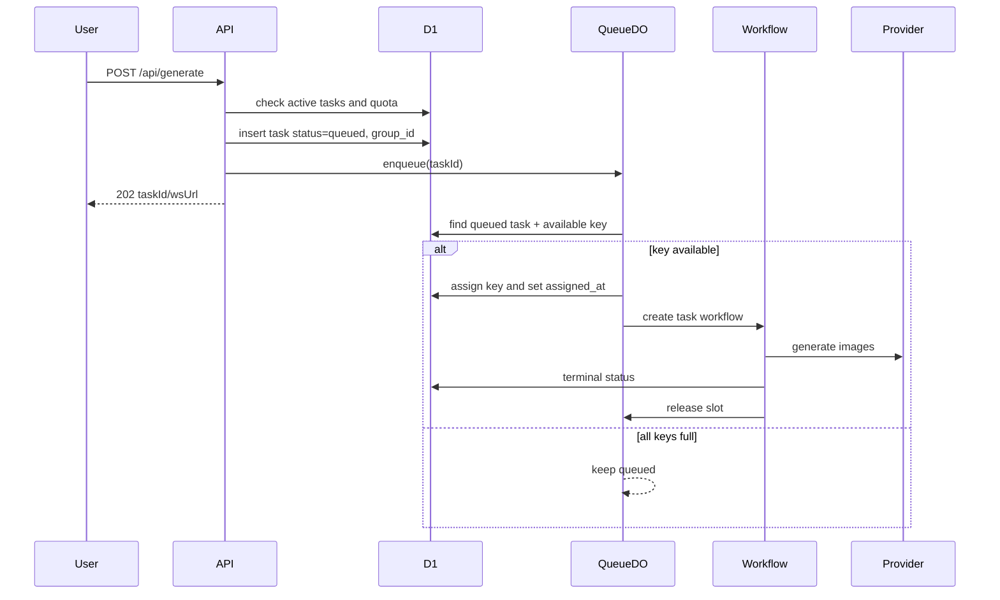

# 需求文档 — Provider Key Group 与生成队列调度

**版本**: v0.1
**日期**: 2026-05-13
**作者**: 用户 + AI
**状态**: 已确认
**关联任务列表**: [`tasks.md`](./tasks.md)

---

## 1. 背景

当前图片生成链路在 `POST /api/generate` 创建任务后立即点火，`queued` 只是任务初始状态，不是容量受控队列。普通用户和管理员同一账号只能有一个活跃任务，sysadmin 可并发提交多个任务；多图任务按 `n` 拆成多次 provider 请求并行执行。这个模型不能表达同一服务商多个 key 的容量，也不能在某个 key 接近并发阈值时自动切到其他 key。

平台需要支持 sysadmin 为同一服务商维护多个 key，并把多个 key 组织成可排序的 key group。管理员与其下属普通用户不再绑定单 key，而是绑定 sysadmin 分配的 key group。生成调度根据 group 内 key 排序和各 key 最大并发数选择 key；如果所有 key 都满载，任务进入真正队列等待，不超时。

---

## 2. 目标

### 2.1 范围内

- ✅ Provider key 支持 `maxConcurrency`，创建和编辑时可配置。
- ✅ Sysadmin 可创建、编辑、删除 provider key group，并在 group 内添加、移除、排序 key。
- ✅ Sysadmin 给 admin 分配指定 key group；admin 下属 user 继承该 group。
- ✅ 调度器按 group 内 key 排序和并发容量选择 key；满载时任务保持 queued 等待。
- ✅ 队列不超时；running 任务仍保留 10 分钟执行超时和恢复兜底。
- ✅ Sysadmin 自身生成任务不受用户级任务数限制，但仍占用 provider key 并发 slot。
- ✅ Sysadmin 可给 admin 配置最大同时任务数，默认 10，最大 15。
- ✅ Admin 可给自己创建的普通 user 配置最大同时任务数，默认 5，最大 10。
- ✅ 前端提供 key group 管理、key 排序、并发数配置和管理员/用户并发配置。
- ✅ 迁移兼容既有单 key 绑定数据。

### 2.2 范围外

- ❌ 不做公开注册、邀请注册或自助购买额度。
- ❌ 不引入外部队列服务或 Cloudflare Queues；本期使用 Durable Objects + D1。
- ❌ 不做基于耗时、429 或错误率的自动动态降并发；先做静态最大并发。
- ❌ 不做队列等待时长 SLA 或 queued 超时失败。
- ❌ 不做跨 provider 自动切换；key group 内 key 必须属于同一 provider。

### 2.3 成功标准

- 多个 key 同属一个 group 时，调度优先使用排序靠前且未满载的 key。
- 排序靠前 key 满载后，新任务自动切到后续可用 key。
- group 内全部 key 满载时，任务保持 `queued`，slot 释放后自动启动。
- admin/user 超过最大同时任务数时创建任务返回 `409 CONFLICT`，不写任务。
- sysadmin 可连续提交多任务，不受用户级任务数限制。
- provider key 明文不进入日志、响应或队列存储。
- `pnpm -F server test`、`pnpm -F server typecheck`、`pnpm -F web test`、`pnpm -F web typecheck` 通过。

---

## 3. 用户场景 / 用户故事

### 3.1 Sysadmin 管理 key group

**角色**: sysadmin

**前置条件**: 已登录，已有至少一个内置 provider。

**步骤**:

1. sysadmin 创建多个 provider key，并为每个 key 设置最大并发数。
2. sysadmin 创建 key group，选择 provider。
3. sysadmin 把多个 key 加入 group。
4. sysadmin 通过拖拽调整 key 顺序并保存。

**预期结果**: group 保存排序后的 key 列表；生成调度按排序优先选择 key。

**异常分支**:

- 如果 key provider 与 group provider 不一致，服务端返回 `VALIDATION_ERROR`。
- 如果 key 已删除或禁用，仍可保留历史成员关系，但调度时不使用。

### 3.2 Sysadmin 给 admin 分配 group

**角色**: sysadmin

**前置条件**: 已存在至少一个 key group。

**步骤**:

1. sysadmin 创建或编辑 admin。
2. 选择 key group。
3. 设置 admin 最大同时任务数，默认 10，最大 15。
4. 保存。

**预期结果**: admin 和其下属 user 使用该 group 调度；不再使用单 key 绑定。

### 3.3 Admin 创建普通用户

**角色**: admin

**前置条件**: admin 已被分配 key group。

**步骤**:

1. admin 创建 user。
2. 设置普通用户最大同时任务数，默认 5，最大 10。
3. 保存。

**预期结果**: user 继承 admin 的 key group；创建/编辑界面不再选择 provider key。

### 3.4 生成任务调度

**角色**: admin 或 user

**前置条件**: 所属 key group 有启用 key。

**步骤**:

1. 用户提交生成任务。
2. 服务端检查用户活跃任务数是否低于上限。
3. 服务端写入 queued 任务，并通知 group 调度器。
4. 调度器扫描 group 内 key，找到可用 key 后占用 slot 并启动 Workflow。
5. 任务完成、失败或取消时释放 slot，并继续调度后续 queued 任务。

**预期结果**: 可用容量内任务自动开始；满载任务排队等待。

**异常分支**:

- 如果 group 无可用 key，任务保持 queued，并向前端展示排队状态。
- 如果 Workflow 启动失败并 fallback inline，slot 仍需和任务绑定，终态释放。

---

## 4. 功能需求

### F1: Provider key 最大并发

**描述**: 每个 provider key 可配置最大同时生成请求数。

**输入**: sysadmin 创建/编辑 provider key 表单中的 `maxConcurrency`，整数范围建议 `[1, 100]`。

**行为**:

- 新 key 默认 `maxConcurrency = 1`。
- 编辑 key 可调整并发上限。
- 调度时仅当 key 当前占用数 `< maxConcurrency` 时可选。

**输出**: provider key 列表返回 `maxConcurrency` 和当前运行占用统计。

**验收标准**:

- [ ] 创建 key 可设置最大并发。
- [ ] 编辑 key 可修改最大并发。
- [ ] 超过 key 最大并发时不再向该 key 派发新任务。

### F2: Provider key group

**描述**: Sysadmin 可按 provider 创建 key group，把同 provider 下多个 key 组合成有序列表。

**输入**: group 名称、providerId、enabled、keyIds 排序列表。

**行为**:

- group 内 key 必须属于同一 provider。
- group 支持启用/禁用、软删。
- key 排序通过 `sortOrder` 持久化。

**输出**: group 列表、group 详情、成员 key 列表。

**验收标准**:

- [ ] 可创建 group 并添加 key。
- [ ] 可拖拽排序并保存。
- [ ] 不允许跨 provider key 加入同一 group。

### F3: Admin 分配 key group

**描述**: Sysadmin 创建/编辑 admin 时必须选择 key group。

**输入**: `providerKeyGroupId`、`maxConcurrentTasks`。

**行为**:

- admin 默认最大同时任务数为 10，最大 15。
- 保存 admin group 后，其下属 user 的实际 provider group 跟随 admin。
- 兼容旧字段时，`preferredProviderKeyId` 和 `user_provider_keys` 不再作为 admin/user 生成入口的权威来源。

**验收标准**:

- [ ] 创建 admin 时选择 key group。
- [ ] 编辑 admin 可更换 key group。
- [ ] admin 无 group 时生成任务明确报错。

### F4: User 最大任务数

**描述**: Admin 可设置下属普通用户最大同时生成任务数。

**输入**: `maxConcurrentTasks`。

**行为**:

- 普通用户默认 5，最大 10。
- 统计 `queued + running`。
- 超限时 `POST /api/generate` 返回 `409 CONFLICT`，details 包含 active count 和 limit。

**验收标准**:

- [ ] user 达到上限后不能创建新任务。
- [ ] admin 只能设置自己下属 user 的上限。
- [ ] sysadmin 可跨租户设置 admin/user 上限。

### F5: 队列调度器

**描述**: 每个 key group 一个 Durable Object 调度器，串行选择 key 并启动任务。

**输入**: 任务 ID、group ID。

**行为**:

- 任务创建后只入队，不立即 `startGenerateTask`。
- 调度器按 `sortOrder` 扫描 group key。
- 占用 key slot 后写入 task 的最终 `providerKeyId` 与 `assignedAt`；`startGenerateTask` 再设置 `startedAt` 并启动 Workflow。
- 任务终态、取消或超时恢复时释放 slot 并唤醒调度。
- 队列不超时。

**输出**: WebSocket 保持 `queued` / `running` / 终态事件。

**验收标准**:

- [ ] key 未满时 queued 任务被启动。
- [ ] 所有 key 满载时任务保持 queued。
- [ ] slot 释放后下一条 queued 自动启动。
- [ ] 重复调度同一任务不会重复占 slot。

### F6: 兼容迁移

**描述**: 旧的单 key 绑定数据迁移到默认 key group。

**行为**:

- 为现有可分配 provider key 创建默认 group 或按 ownerAdmin 分组。
- 给已有 admin/user 设置 `providerKeyGroupId`。
- 保留旧表和字段用于兼容展示或回滚，但新逻辑不依赖它们。

**验收标准**:

- [ ] 迁移后已有 admin/user 可继续生成。
- [ ] 迁移不泄露 key 明文。
- [ ] 回滚时旧字段仍存在。

---

## 5. 非功能需求

### 5.1 性能

- `POST /api/generate` 仍应快速返回 202，不等待上游 provider。
- 调度一次最多扫描当前 group 的有效 key 和有限 queued 任务，避免全表扫描。
- group/key 列表页 p95 应小于 500ms。

### 5.2 安全

- Provider key 明文只在创建、编辑和测试时进入服务端内存；禁止写日志和响应。
- Key group API 仅 sysadmin 可写。
- Admin 只能设置下属 user 并发，不可接触 key 明细和密钥明文。
- 所有 SQL 使用 Drizzle 或 D1 bind 参数。

### 5.3 可访问性

- 拖拽排序提供可点击的上移/下移按钮兜底。
- 表单字段有 label，按钮有明确文本或 tooltip。
- 排队状态与错误提示不只依赖颜色。

### 5.4 国际化

- 新增前端文案同步 `zh-CN` 和 `en-US`。

### 5.5 可观测性

- 关键日志：任务入队、调度命中 key、group 满载、slot 释放、恢复修复。
- sysadmin dashboard 后续可扩展展示 queued/running、key slot 使用率和 oldest queued age。

---

## 6. 技术栈与依赖

### 6.1 选型

| 维度               | 选型                                       | 版本            | 理由                         |
| ------------------ | ------------------------------------------ | --------------- | ---------------------------- |
| Worker 框架        | Hono                                       | 4.12.18         | 现有路由栈                   |
| 数据库 ORM         | Drizzle ORM                                | 0.45.2          | 现有 D1 schema 和迁移        |
| Cloudflare Runtime | Workers / D1 / Durable Objects / Workflows | wrangler 4.90.1 | 现有部署目标                 |
| 前端               | Vue 3                                      | 3.5.34          | 现有应用                     |
| 拖拽               | @vueuse/core `useDraggable`                | 14.3.0          | 项目已安装，满足用户指定方案 |

### 6.2 新增依赖

无新增 npm 依赖。

### 6.3 环境变量

无新增环境变量。

---

## 7. 架构概览

### 7.1 整体架构图



### 7.2 数据模型



| 表                           | 新增/调整字段                                                        | 说明                                                                                                  |
| ---------------------------- | -------------------------------------------------------------------- | ----------------------------------------------------------------------------------------------------- |
| `provider_keys`              | `max_concurrency`                                                    | key 级最大并发                                                                                        |
| `provider_key_groups`        | `id, provider_id, name, enabled, created_at, updated_at, deleted_at` | key group 主表                                                                                        |
| `provider_key_group_members` | `group_id, provider_key_id, sort_order, created_at, updated_at`      | group 有序成员                                                                                        |
| `users`                      | `provider_key_group_id, max_concurrent_tasks`                        | 用户所属 group 与任务上限                                                                             |
| `tasks`                      | `provider_key_group_id, provider_key_id, assigned_at`                | 任务队列与调度状态；queued 未 assigned 时 `provider_key_id` 为兼容占位值，slot 占用只看 `assigned_at` |

### 7.3 关键流程



### 7.4 模块划分

```text
server/src/lib/providerKeyGroups.ts      # group 解析、分配、能力快照
server/src/lib/generationPolicy.ts       # 用户任务上限策略
server/src/lib/tasks/queue.ts            # 入队与调度门面
server/src/do/GenerateQueue.ts           # Durable Object 调度器
server/src/routes/sysadmin/keyGroups.ts  # sysadmin group API
server/src/routes/admin/users.ts         # 用户并发配置
web/src/views/sysadmin/Keys.vue          # key 与 group 管理 UI
```

---

## 8. 开放风险

| 风险                            | 概率 | 影响 | 缓解方案                                               |
| ------------------------------- | ---- | ---- | ------------------------------------------------------ |
| Slot 泄露导致队列永久满载       | 中   | 高   | 终态释放、recovery 修复、DO alarm 扫描 running 任务    |
| 旧单 key 绑定迁移不完整         | 中   | 高   | 写迁移脚本和兼容 fallback，单测覆盖旧数据              |
| DO 与 Workflow 启动之间失败     | 中   | 中   | D1 记录 assigned 状态，recovery 可重新 dispatch 或释放 |
| 前端拖拽在移动端可用性差        | 中   | 中   | 提供上移/下移按钮兜底                                  |
| key group 内混入跨 provider key | 低   | 高   | 服务端校验和 DB 查询过滤双保险                         |

---

## 9. 开放问题 / 待用户拍板

- [x] sysadmin 不受用户级任务数限制，但仍受 provider key/group 并发调度约束。
- [x] queued 不超时。
- [x] key group 内 key 按排序选择，满载自动尝试后续 key。

---

## 10. 参考资料

- [Cloudflare Durable Objects](https://developers.cloudflare.com/durable-objects/)
- [Durable Object storage best practices](https://developers.cloudflare.com/durable-objects/best-practices/access-durable-objects-storage/)
- [Durable Object alarms](https://developers.cloudflare.com/durable-objects/api/alarms/)
- [VueUse useDraggable](https://vueuse.org/core/usedraggable/)

---

## 变更历史

| 日期       | 版本 | 变更                                           |
| ---------- | ---- | ---------------------------------------------- |
| 2026-05-13 | v0.1 | 初稿，确认 key group、并发调度与无 queued 超时 |
