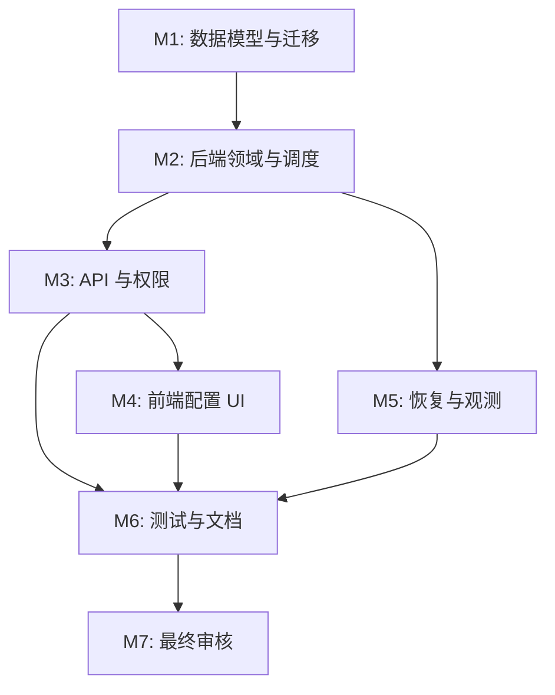

# 任务列表 — Provider Key Group 与生成队列调度

**关联需求**: [`requirements.md`](./requirements.md)
**估算量级**: 超大 (审核轮数：10+)
**总体进度**: ✅ 31 / 31

---

## 状态图例

| Emoji | 状态   | 含义                       |
| ----- | ------ | -------------------------- |
| ⏳    | 待开始 | 还没开始                   |
| 🚧    | 进行中 | 当前正在做                 |
| ✅    | 已完成 | 自检通过、commit/push 完毕 |
| ⚠️    | 阻塞中 | 等待外部决策 / 修不动      |
| 🔍    | 待审核 | 自己做完了等用户 review    |

---

## 里程碑依赖图

---

## Milestone 1: 数据模型与迁移

**目标**: 建立 key group、key 并发、用户任务上限和任务调度字段。
**依赖**: 无
**状态**: ✅

### Task 1.1 ✅ 设计并更新 Drizzle schema

**描述**: 在 `schema.ts` 增加 provider key group 表、成员表，以及 provider key、users、tasks 的调度字段。

**依赖**: 无
**阻塞**: T1.2, T2.1, T3.1

**预估**: 2h

**关联文件 / 模块**:

- `server/src/db/schema.ts`

**验收**:

- [x] Schema 类型导出新表行类型。
- [x] 字段命名与现有 camelCase/SQLite snake_case 约定一致。
- [x] 任务 provider key 字段支持 queued 时为空或兼容旧值。

#### 备注

- 🐛 **遇到的问题**: `tasks.providerKeyId` 改为 nullable 后，旧运行上下文和测试 fixture 需要显式处理未分配 key。
- 🔧 **最终实现逻辑**: 在 schema 中新增 `provider_key_groups`、`provider_key_group_members`、`provider_keys.max_concurrency`、`users.provider_key_group_id`、`users.max_concurrent_tasks`、`sessions.provider_key_group_id`、`tasks.provider_key_group_id` 和 `tasks.assigned_at`，并补关系与行类型导出。
- 🎯 **关键决策**: 保留旧单 key 字段与绑定表用于兼容迁移；queued 任务用 `assigned_at` 判断是否真正占用 provider key slot，`provider_key_id` 在未 assigned 时可为兼容占位值。

---

### Task 1.2 ✅ 生成并审阅 D1 migration

**描述**: 运行 `pnpm -F server db:gen`，审查 SQL，补充兼容旧数据的默认 group 和字段回填。

**依赖**: T1.1
**阻塞**: T1.3

**预估**: 2h

**关联文件 / 模块**:

- `server/migrations/*`

**验收**:

- [x] migration 可创建新表和索引。
- [x] 旧 provider key/admin/user 数据有兼容 group。
- [x] 不删除旧字段和旧表。

#### 备注

- 🐛 **遇到的问题**: `pnpm -F server db:gen` 因仓库缺少 `server/migrations/meta/_journal.json` 无法生成增量迁移。
- 🔧 **最终实现逻辑**: 手写 `0011_provider_key_groups_queue.sql`，新增 group 表/成员表/索引/调度字段，并把每把旧 key 回填为一个默认 group；本地 D1 迁移和 `pnpm -F server typecheck` 已通过。
- 🎯 **关键决策**: 旧 key 各自迁移为独立默认 group，避免按 provider 合并导致管理员突然获得同 provider 下其他 key 的使用权。

---

### Task 1.3 ✅ 更新数据库文档

**描述**: 更新数据库文档中账号、密钥、绑定和任务实体说明。

**依赖**: T1.2
**阻塞**: T6.4

**预估**: 1h

**关联文件 / 模块**:

- `docs/DATABASE.md`

**验收**:

- [x] 文档说明 key group 是新权威分配模型。
- [x] 说明旧 `user_provider_keys` 仅兼容保留。

#### 备注

- 🐛 **遇到的问题**: 无。
- 🔧 **最终实现逻辑**: 更新 `docs/DATABASE.md` 的主要实体表和迁移说明，标明 `provider_key_groups`/members 是 0011 后的权威分配模型。
- 🎯 **关键决策**: 文档明确旧 `user_provider_keys` 和 `preferred_provider_key_id` 暂不删除，用于兼容、审计和回滚。

---

## Milestone 2: 后端领域与调度

**目标**: 实现 key group 解析、用户并发策略、DO 队列调度和 slot 生命周期。
**依赖**: M1
**状态**: ✅

### Task 2.1 ✅ 实现 key group 领域函数

**描述**: 新建 provider key group 领域模块，提供 group 解析、成员校验、能力快照和迁移 fallback。

**依赖**: T1.1
**阻塞**: T2.3, T3.1, T3.2

**预估**: 3h

**关联文件 / 模块**:

- `server/src/lib/providerKeyGroups.ts`
- `server/src/lib/providerKeys.ts`

**验收**:

- [x] 可根据用户解析有效 provider key group。
- [x] group 内 provider 能力与前端 `/me` 能力一致。
- [x] 无 group 时返回明确业务错误。

#### 备注

- 🐛 **遇到的问题**: `/me` 和登录响应当前依赖旧 `providerKeys.ts` 导出的能力函数，直接替换会影响多个入口。
- 🔧 **最终实现逻辑**: 新增 `server/src/lib/providerKeyGroups.ts`，提供用户 group 解析、group 能力快照、成员同 provider 校验，并在 `providerKeys.ts` 兼容 re-export `getProviderCapabilitiesForUser`。
- 🎯 **关键决策**: 迁移期能力解析优先 group，缺 group 时允许从旧单 key 绑定生成虚拟 group；任务创建会在后续任务切到真实 group。

---

### Task 2.2 ✅ 实现用户最大任务数策略

**描述**: 替换现有非 sysadmin 单任务限制，按角色和用户配置计算最大 `queued + running` 数。

**依赖**: T1.1
**阻塞**: T2.3, T3.3

**预估**: 2h

**关联文件 / 模块**:

- `server/src/lib/generationPolicy.ts`
- `server/src/lib/tasks/create.ts`

**验收**:

- [x] sysadmin 不受用户级任务数限制。
- [x] admin 默认 10、最大 15。
- [x] user 默认 5、最大 10。
- [x] 超限返回 409 details。

#### 备注

- 🐛 **遇到的问题**: 旧函数名 `assertNoActiveGenerationTask` 已被多处依赖，直接改名会扩大改动范围。
- 🔧 **最终实现逻辑**: 保持旧函数名作为创建任务前的活跃任务检查，但内部改为统计 `queued + running` 并使用角色默认/配置上限；补充 `generationPolicy` 纯函数和单测。
- 🎯 **关键决策**: sysadmin 返回 `null` 表示不受用户级任务数限制；admin/user 的非法配置在解析时回退默认值，写入 API 后续再用显式校验拦截。

---

### Task 2.3 ✅ 改造任务创建为入队

**描述**: `createGenerateTask` 写入 group 信息和 queued 任务，不在创建阶段固定最终 key；路由调用入队调度而不是直接点火。

**依赖**: T2.1, T2.2
**阻塞**: T2.4, T2.5

**预估**: 3h

**关联文件 / 模块**:

- `server/src/lib/tasks/create.ts`
- `server/src/routes/generate.ts`
- `server/src/lib/tasks/queue.ts`
- `server/src/lib/tasks.ts`

**验收**:

- [x] 任务创建成功后返回 202 和 wsUrl。
- [x] queued 任务包含 providerKeyGroupId。
- [x] provider 能力校验仍在创建前执行。

#### 备注

- 🐛 **遇到的问题**: DO 调度器尚未实现时，如果立即停止写 `providerKeyId`，旧 `runGenerateTask` 会无法运行。
- 🔧 **最终实现逻辑**: `createGenerateTask` 改为解析 provider key group 并写入 `providerKeyGroupId`，provider 能力校验基于 group provider；新增 `enqueueGenerateTask` 门面，路由改为调用该门面。
- 🎯 **关键决策**: 在 T2.4 前保持兼容：任务仍写 group 首个 key 作为 `providerKeyId` 并继续 inline dispatch；DO 调度器完成后再收紧为调度时分配。

---

### Task 2.4 ✅ 实现 GenerateQueue Durable Object

**描述**: 新增每 group 一个 DO 的调度器，串行选择可用 key、占用 slot、启动 Workflow，并在满载时保持 queued。

**依赖**: T2.3
**阻塞**: T2.5, T5.1

**预估**: 5h

**关联文件 / 模块**:

- `server/src/do/GenerateQueue.ts`
- `server/src/lib/tasks/queue.ts`
- `server/wrangler.jsonc`

**验收**:

- [x] group 有空 slot 时任务被 dispatch。
- [x] group 满载时任务保持 queued。
- [x] 调度过程幂等，重复 enqueue 不重复占 slot。
- [x] DO migration 在 wrangler 配置中登记。

#### 备注

- 🐛 **遇到的问题**: Durable Object 的 `id.toString()` 不是 `idFromName()` 原始名称，不能从 DO id 反推出 groupId。
- 🔧 **最终实现逻辑**: 新增 `GenerateQueue` DO，`enqueue(taskId, groupId)` 显式传 groupId 并写入 DO storage；调度按 D1 中最早 queued 任务和 group 成员排序选择可用 key，用 `assigned_at` 幂等占用 slot，再调用 `startGenerateTask`。
- 🎯 **关键决策**: D1 作为事实源，DO 只做同 group 串行协调；满载时设置短 alarm 兜底，真正持续推进还依赖后续终态 release。

---

### Task 2.5 ✅ 改造 run/failure/finish 释放 slot

**描述**: 任务成功、失败、取消、超时恢复和 claim lost 等路径正确释放 provider key slot 并唤醒队列。

**依赖**: T2.4
**阻塞**: T5.1, T6.1

**预估**: 4h

**关联文件 / 模块**:

- `server/src/lib/tasks/run.ts`
- `server/src/lib/tasks/failure.ts`
- `server/src/lib/tasks/recovery.ts`
- `server/src/routes/generate.ts`
- `server/src/lib/tasks/state.ts`

**验收**:

- [x] succeeded/failed/cancelled 均释放 slot。
- [x] running 超时失败释放 slot。
- [x] 释放后调度下一条 queued。

#### 备注

- 🐛 **遇到的问题**: 失败上下文原本没有 `providerKeyGroupId` 类型，超时恢复 SQL 也没查 group 字段。
- 🔧 **最终实现逻辑**: 新增 `releaseGenerateTaskSlotNow`/`releaseGenerateTaskSlot`，在成功、失败、崩溃图片恢复、超时失败和取消路径调用；补齐 recovery 查询中的 `provider_key_group_id`。
- 🎯 **关键决策**: 不清空终态任务的 `provider_key_id`，保留审计归属；slot 占用只统计 `queued/running + assigned_at`，终态自然释放。

---

### Task 2.6 ✅ 调整 Workflow/dispatch 租约语义

**描述**: 确保 `startGenerateTask` 只由调度器调用，且 running claim 与 assigned key/group 绑定。

**依赖**: T2.4
**阻塞**: T6.1

**预估**: 2h

**关联文件 / 模块**:

- `server/src/lib/tasks/dispatch.ts`
- `server/src/workflows/GenerateImage.ts`
- `server/src/lib/tasks/state.ts`

**验收**:

- [x] 非调度器路径不会绕过 key slot。
- [x] Workflow fallback inline 不丢 slot 绑定。

#### 备注

- 🐛 **遇到的问题**: `startGenerateTask` 原本是同步注册 waitUntil，无法先检查 assigned 状态。
- 🔧 **最终实现逻辑**: `startGenerateTask` 现在把异步检查包进 waitUntil；只有 `status=queued` 且已有 `provider_key_id`/`assigned_at` 的任务才会启动 Workflow 或 inline fallback。
- 🎯 **关键决策**: 非调度器路径直接点火会被跳过，后续恢复扫描必须改为 enqueue，避免绕过 key slot。

---

## Milestone 3: API 与权限

**目标**: 暴露 sysadmin key group API，调整 admin/user API 契约和 `/me` 能力。
**依赖**: M2
**状态**: ✅

### Task 3.1 ✅ 新增 sysadmin key group API

**描述**: 提供 group CRUD、成员增删、排序保存和 group 可用 key 列表。

**依赖**: T2.1
**阻塞**: T4.1

**预估**: 4h

**关联文件 / 模块**:

- `server/src/routes/sysadmin/keyGroups.ts`
- `server/src/routes/sysadmin.ts`

**验收**:

- [x] sysadmin 可创建/编辑/删除 group。
- [x] sysadmin 可保存成员排序。
- [x] 跨 provider 成员被拒绝。

#### 备注

- 🐛 **遇到的问题**: group 修改 provider 时必须保证现有成员仍属于新 provider，否则会留下不可调度的混合 group。
- 🔧 **最终实现逻辑**: 新增 `routes/sysadmin/keyGroups.ts`，提供 group 列表/详情/创建/编辑/删除和 `PUT members` 排序保存；创建、换 provider、保存成员时均校验 key 同 provider。
- 🎯 **关键决策**: 删除 group 采用软删并禁用，保留审计和历史任务引用。

---

### Task 3.2 ✅ 调整 provider key API

**描述**: provider key 创建/编辑支持 `maxConcurrency`，列表返回 group 和运行统计所需字段。

**依赖**: T1.1, T2.1
**阻塞**: T4.1

**预估**: 2h

**关联文件 / 模块**:

- `server/src/routes/sysadmin/providerKeys.ts`
- `server/src/routes/admin/providerKeys.ts`

**验收**:

- [x] sysadmin key 表单可读写最大并发。
- [x] admin 不再以单 key 作为生成分配入口。

#### 备注

- 🐛 **遇到的问题**: 无。
- 🔧 **最终实现逻辑**: sysadmin provider key 创建/编辑 schema 支持 `maxConcurrency`，列表由 schema 自动返回该字段；admin 侧后续不再用单 key 分配生成入口。
- 🎯 **关键决策**: 单 key 并发配置限制为 1-100，先做静态上限，动态降并发留到后续。

---

### Task 3.3 ✅ 调整 admin/user API

**描述**: admin 创建/编辑切到 `providerKeyGroupId` 和 `maxConcurrentTasks`；普通用户移除 providerKeyId 选择。

**依赖**: T2.2
**阻塞**: T4.2

**预估**: 4h

**关联文件 / 模块**:

- `server/src/routes/sysadmin/admins.ts`
- `server/src/routes/admin/users.ts`
- `server/src/routes/admin/providerKeys.ts`

**验收**:

- [x] sysadmin 创建 admin 必须选 group。
- [x] admin 创建 user 不可选 key，只能设用户并发。
- [x] 权限边界保持：admin 只能管下属 user。

#### 备注

- 🐛 **遇到的问题**: 旧 admin/user API 同时承担 sysadmin 和 admin 入口，直接删除单 key 字段会影响列表与编辑回显。
- 🔧 **最终实现逻辑**: `sysadmin/admins` 创建/编辑改为 `providerKeyGroupId + maxConcurrentTasks`；`admin/users` 创建普通用户时继承管理员 group，编辑下属普通用户时只允许修改并发、昵称和状态，sysadmin 仍可调整 group。
- 🎯 **关键决策**: 新契约不再写 `user_provider_keys`；旧字段只保留读取兼容，生成分配以 `users.provider_key_group_id` 为准。

---

### Task 3.4 ✅ 更新 `/api/me` 能力返回

**描述**: 当前用户 provider 能力从 key group 解析，返回 group 和 provider 能力快照。

**依赖**: T2.1
**阻塞**: T6.2

**预估**: 2h

**关联文件 / 模块**:

- `server/src/routes/me.ts`
- `server/src/lib/providerKeys.ts`
- `web/src/stores/auth.ts`

**验收**:

- [x] 前端能力提示仍准确。
- [x] 无 group/无可用 key 时提交有明确错误。

#### 备注

- 🐛 **遇到的问题**: 前端 `ProviderCapabilities.providerKeyId` 原本是必填字符串，和 queued 阶段不固定最终 key 的新语义冲突。
- 🔧 **最终实现逻辑**: `AuthUser` 与前端 store 增加 `providerKeyGroupId`、`maxConcurrentTasks`；`ProviderCapabilities` 增加 group 字段并允许 `providerKeyId=null`，服务端 `/me`/登录继续复用 group 能力解析。
- 🎯 **关键决策**: 能力快照保留首个 key 的 model 作为默认模型提示，但调度时仍按 group 内 key 排序和并发动态选择最终 key。

---

### Task 3.5 ✅ 同步 OpenAPI 源

**描述**: 更新机器可读 OpenAPI 路径和 schema。

**依赖**: T3.1, T3.2, T3.3
**阻塞**: T6.4

**预估**: 2h

**关联文件 / 模块**:

- `server/src/docs/openapi.ts`
- `server/src/docs/openapi/*`

**验收**:

- [x] 新 key group API 出现在 OpenAPI。
- [x] 修改后的 admin/user/provider key 字段同步。

#### 备注

- 🐛 **遇到的问题**: 现有 OpenAPI 把 sysadmin provider key 路径放在 `adminPaths.ts` 中，不能只改 `sysadminPaths.ts`。
- 🔧 **最终实现逻辑**: 更新 `AuthUser`、`ProviderCapabilities`、`AdminUser`、`ProviderKeySummary` schema，新增 `ProviderKeyGroup` schema 和 key group CRUD/member 路径；同步 admin/user/sysadmin admin 的 group 与并发字段。
- 🎯 **关键决策**: `/api/admin/provider-keys` 在 OpenAPI 中标注为历史兼容接口，避免前端和新集成继续把单 key 当生成分配入口。

---

## Milestone 4: 前端配置 UI

**目标**: 完成 sysadmin key group 管理、拖拽排序和 admin/user 并发配置。
**依赖**: M3
**状态**: ✅

### Task 4.1 ✅ 重构 sysadmin Keys 页面

**描述**: 在密钥管理页增加 key group 管理区、group 详情、成员排序、key 并发编辑。

**依赖**: T3.1, T3.2
**阻塞**: T4.3

**预估**: 6h

**关联文件 / 模块**:

- `web/src/views/sysadmin/Keys.vue`
- `web/src/views/sysadmin/useSysadminKeysController.ts`
- `web/src/locales/zh-CN.json`
- `web/src/locales/en-US.json`

**验收**:

- [x] 可创建/编辑 key 并设置最大并发。
- [x] 可创建/编辑 group。
- [x] 可将 key 加入 group 并排序。
- [x] 排序有上移/下移按钮兜底。

#### 备注

- 🐛 **遇到的问题**: group 列表 API 原本不返回 members，前端如果逐个详情请求会造成配置页加载复杂且慢。
- 🔧 **最终实现逻辑**: group 列表改为带成员；密钥页新增 key 最大并发表单、key group 管理区、成员添加/移除、VueUse `useDraggable` 排序和上下按钮排序兜底。
- 🎯 **关键决策**: 拖拽只作为快速排序入口，按钮排序始终保留，避免移动端或键盘场景无法操作。

---

### Task 4.2 ✅ 调整 admin 用户管理 UI

**描述**: 用户创建/编辑表单展示 key group 和最大同时任务数，不再让 admin 为普通用户选 key。

**依赖**: T3.3
**阻塞**: T4.3

**预估**: 4h

**关联文件 / 模块**:

- `web/src/views/admin/UserList.vue`
- `web/src/views/admin/useAdminUsersController.ts`
- `web/src/views/admin/adminUserTypes.ts`
- `web/src/views/admin/adminUserPayloads.ts`
- `web/src/views/admin/adminUserHelpers.ts`

**验收**:

- [x] sysadmin 创建 admin 时选择 key group 和并发上限。
- [x] admin 创建 user 时只设置普通用户并发上限。
- [x] 用户表和详情展示 group/并发信息。

#### 备注

- 🐛 **遇到的问题**: 项目里同时存在 `/admin/users` 和 sysadmin 专用 `/sysadmin/admins` 两套管理员配置入口，必须同步改契约。
- 🔧 **最终实现逻辑**: 用户管理页、用户详情侧栏、管理员专用页都改为展示/提交 `providerKeyGroupId` 与 `maxConcurrentTasks`；普通 admin 创建 user 时不再看到单 key/group 选择，只能配置普通用户并发。
- 🎯 **关键决策**: `maxConcurrentTasks` 对 admin/user 共用同一输入控件，前端按角色限制 max，最终仍以后端校验为准。

---

### Task 4.3 ✅ 前端 API 类型与 i18n 对齐

**描述**: 更新 API 调用类型、错误展示和中英文文案。

**依赖**: T4.1, T4.2
**阻塞**: T6.3

**预估**: 2h

**关联文件 / 模块**:

- `web/src/views/admin/adminUserApi.ts`
- `web/src/views/sysadmin/useSysadminKeysController.ts`
- `web/src/locales/*.json`

**验收**:

- [x] `vue-tsc` 无类型错误。
- [x] 新文案中英文都有。

#### 备注

- 🐛 **遇到的问题**: admin 用户管理模块残留了 `ProviderKeyRow`、`providerKeyId`、`keyLabel` 等历史类型，容易让后续 UI 再接回单 key。
- 🔧 **最终实现逻辑**: 清理 admin 用户模块单 key 类型和 fetch；补齐中英文 `providerKeyGroup`、`maxConcurrency`、`maxConcurrentTasks`、key group 操作文案；`vue-tsc` 通过。
- 🎯 **关键决策**: sysadmin 的个人偏好仍保留旧 `preferredProviderKeyId`，因为它属于系统管理员个人默认 key，不参与管理员/普通用户的分组调度分配。

---

### Task 4.4 ✅ 浏览器验证配置 UI

**描述**: 启动本地前端，使用 Browser 检查 key group 管理和用户表单布局。

**依赖**: T4.1, T4.2, T4.3
**阻塞**: T6.3

**预估**: 2h

**关联文件 / 模块**:

- `web/src/views/sysadmin/Keys.vue`
- `web/src/views/admin/UserList.vue`

**验收**:

- [x] 桌面视口无文本重叠。
- [x] 移动宽度关键表单可滚动/可操作。
- [x] 拖拽或上下移动排序可用。

#### 备注

- 🐛 **遇到的问题**: 本机 `localhost:5173` 的 IPv6 地址已有其他应用，需用 `127.0.0.1:5173` 访问本项目；`pnpm dev` 未自动带起 Worker，需要单独启动 `pnpm -F server dev`。
- 🔧 **最终实现逻辑**: 使用 sysadmin 登录态在 Browser 验证 `/sysadmin/keys` 和 `/admin/users`：密钥表展示最大并发，key group 面板展示成员、排序按钮和添加下拉；用户创建弹窗展示密钥分组和最大同时任务数。
- 🎯 **关键决策**: 移动端主要依赖现有横向滚动表格与紧凑弹窗；拖拽排序保留按钮兜底，Browser 验证确认按钮在单成员场景下可见并正确禁用上下移动。

---

## Milestone 5: 恢复与观测

**目标**: 保证调度状态在 Worker/Workflow/DO 中断后可恢复，并能被日志观测。
**依赖**: M2
**状态**: ✅

### Task 5.1 ✅ 实现队列恢复扫描

**描述**: 扩展 recovery：重启 queued 调度、修复超时 running、释放孤儿 slot、唤醒 group DO。

**依赖**: T2.5
**阻塞**: T5.2, T6.1

**预估**: 4h

**关联文件 / 模块**:

- `server/src/lib/tasks/recovery.ts`
- `server/src/do/GenerateQueue.ts`
- `server/src/index.ts`

**验收**:

- [x] queued 任务在访问相关接口或 cron 后可恢复调度。
- [x] running 超时仍按原 10 分钟失败或恢复。
- [x] slot 统计与 D1 running 任务一致。

#### 备注

- 🐛 **遇到的问题**: 旧恢复逻辑直接调用 `startGenerateTask`，新调度语义下会跳过未 assigned 的 queued 任务。
- 🔧 **最终实现逻辑**: queued 恢复改为按 `provider_key_group_id` 唤醒 GenerateQueue DO；无 group 的兼容任务仍走 enqueue fallback；同时重置超时仍处于 queued 的 assigned 孤儿任务，释放 key slot 后重新排队。
- 🎯 **关键决策**: 使用 D1 `assigned_at` 作为孤儿 slot 判断，不依赖 DO 内存状态；DO storage 只保存 groupId 供 alarm 兜底。

---

### Task 5.2 ✅ 增加调度日志与审计

**描述**: 对 key group 创建、排序、任务调度、满载、释放 slot 打结构化日志和审计。

**依赖**: T3.1, T5.1
**阻塞**: T6.4

**预估**: 2h

**关联文件 / 模块**:

- `server/src/lib/log.ts` 调用点
- `server/src/lib/audit.ts` 调用点

**验收**:

- [x] 日志不包含 key 明文。
- [x] sysadmin 写操作有 audit。
- [x] 满载排队和释放 slot 可从日志追踪。

#### 备注

- 🐛 **遇到的问题**: group 成员排序审计需要可追踪顺序，但不能包含 key 明文。
- 🔧 **最终实现逻辑**: DO 调度保留 enqueue/full/dispatch/assign skip/release 日志，恢复扫描增加 stale assigned reset 日志；group CRUD 与成员排序写 audit，payload 只包含 group/key ID、数量和状态变更。
- 🎯 **关键决策**: 日志与 audit 只记录 provider key ID/hint 级别的非敏感标识，不记录 encryptedKey 或 apiKey。

---

## Milestone 6: 测试与文档

**目标**: 覆盖关键调度、权限、前端表单和文档契约。
**依赖**: M3, M4, M5
**状态**: ✅

### Task 6.1 ✅ 服务端调度单测

**描述**: 覆盖 key 选择、满载排队、释放后继续调度、用户并发上限。

**依赖**: T2.5, T5.1
**阻塞**: T6.5

**预估**: 5h

**关联文件 / 模块**:

- `server/test/*`

**验收**:

- [x] key 1 满载自动用 key 2。
- [x] 所有 key 满载时不启动。
- [x] release 后启动下一条 queued。
- [x] admin/user/sysadmin 并发策略通过测试。

#### 备注

- 🐛 **遇到的问题**: 旧 `tasks.provider_key_id NOT NULL` 与“先排队后分配 key”存在兼容冲突；legacy 单 key fallback 生成的虚拟 group 没有真实 FK 行，创建 session/task 会失败。
- 🔧 **最终实现逻辑**: queued 任务保留 group 首个 key 作为兼容占位值，但 `assigned_at=NULL` 表示未占用 slot；调度器占用 slot 时覆盖为最终 key。抽出 `tasks/scheduler.ts` 供 DO 和测试共用，覆盖 key 选择、全满、幂等 assigned、终态释放、stale assigned 重置和用户并发上限。
- 🎯 **关键决策**: 以 `assigned_at` 作为唯一 slot 占用信号，避免 D1 表重建迁移风险；legacy fallback 在解析时自愈创建真实 `pkg_<keyId>` group/member，保证旧绑定也能进入新队列模型；Vitest/Miniflare 队列测试用单 worker 运行以避免测试进程资源冲突。

---

### Task 6.2 ✅ 服务端 API 权限测试

**描述**: 覆盖 sysadmin key group API、admin/user 编辑并发权限、无 group 错误。

**依赖**: T3.1, T3.3, T3.4
**阻塞**: T6.5

**预估**: 4h

**关联文件 / 模块**:

- `server/test/*`

**验收**:

- [x] 非 sysadmin 不能写 key group。
- [x] admin 不能设置非下属用户并发。
- [x] 无 group 生成返回明确错误。

#### 备注

- 🐛 **遇到的问题**: `/api/generate` 路由测试会经过真实 rate limit，需要测试 KV stub 覆盖 `get/put` 或直接设置 dev 环境。
- 🔧 **最终实现逻辑**: 新增 `apiPermissions.test.ts`，使用真实 Hono 路由、JWT、`requireAuth/requireRole`，覆盖非 sysadmin 写 group、sysadmin 创建 group、admin 下属/非下属编辑、admin 禁止改 group、无 group 生成错误。
- 🎯 **关键决策**: 权限测试不直接 `c.set("user")` 绕过中间件；只 stub KV 与 GenerateQueue 外部 binding，保证路由层权限链路被覆盖。

---

### Task 6.3 ✅ 前端单测

**描述**: 覆盖 key group controller、用户表单 payload 和排序逻辑。

**依赖**: T4.3
**阻塞**: T6.5

**预估**: 4h

**关联文件 / 模块**:

- `web/src/views/sysadmin/*.test.ts`
- `web/src/views/admin/*.test.ts`

**验收**:

- [x] group 排序 payload 正确。
- [x] admin/user 创建编辑 payload 正确。
- [x] i18n key 不缺失。

#### 备注

- 🐛 **遇到的问题**: i18n 测试放在 `src/locales` 下会被 `@intlify/unplugin-vue-i18n` 当作 locale 资源编译；JSON import 也会被编译成消息 AST。
- 🔧 **最终实现逻辑**: 新增 admin payload/helper、sysadmin key group 排序、provider key queue i18n 三组前端测试；抽出 `reorderProviderKeyIds` 纯函数并让 controller 复用。
- 🎯 **关键决策**: 前端测试优先覆盖提交契约和排序数据，而不是耦合整页 DOM；i18n 只断言 key 存在，兼容插件编译后的消息结构。

---

### Task 6.4 ✅ 更新 API/可靠性/运维文档

**描述**: 同步 API、RELIABILITY、OPERATIONS、ARCHITECTURE/AGENTS 必要说明。

**依赖**: T1.3, T3.5, T5.2
**阻塞**: T6.5

**预估**: 3h

**关联文件 / 模块**:

- `docs/API.md`
- `docs/RELIABILITY.md`
- `docs/OPERATIONS.md`
- `ARCHITECTURE.md`
- `AGENTS.md`

**验收**:

- [x] 文档说明真实队列与 key group。
- [x] 运维说明如何排查 stuck queued/running。
- [x] AGENTS 入口更新关键约定。

#### 备注

- 🐛 **遇到的问题**: 文档同步时发现已配置 group 被禁用/删除后仍可能通过旧绑定 fallback 自愈，绕过 sysadmin 禁用意图。
- 🔧 **最终实现逻辑**: 更新 API、RELIABILITY、OPERATIONS、ARCHITECTURE、AGENTS，补充真实 key group 队列、迁移依赖、排障 SQL、日志事件和 AI 助手入口约定；同时收紧 group 解析逻辑，已有 group 无效时直接报错。
- 🎯 **关键决策**: legacy `user_provider_keys` 只服务于“用户尚未写入 providerKeyGroupId”的迁移兼容；一旦用户有明确 group，就不再 fallback。

---

### Task 6.5 ✅ 全量验证

**描述**: 运行 lint/typecheck/test/build，修复发现的问题。

**依赖**: T6.1, T6.2, T6.3, T6.4
**阻塞**: M7

**预估**: 3h

**关联文件 / 模块**:

- 全仓库

**验收**:

- [x] `pnpm lint` 通过。
- [x] `pnpm typecheck` 通过。
- [x] `pnpm test` 通过。
- [x] `pnpm build` 通过或记录明确外部阻塞。

#### 备注

- 🐛 **遇到的问题**: 根级 `pnpm test` 原本并行跑 server/web，server 的 Miniflare/D1 测试偶发 Vitest worker 退出；D1 表重建迁移方案在 Wrangler 本地迁移中会触发外键约束失败。
- 🔧 **最终实现逻辑**: server Vitest 改为单 worker、根级 test 改为 server 后 web 顺序执行；队列改用 `assigned_at` 作为 slot 占用信号并保留兼容 provider key 占位，避免需要 0012 重建任务表。
- 🎯 **关键决策**: 默认验证命令应稳定反映真实测试结果，而不是受 Miniflare 并行资源竞争影响；不做高风险 D1 表重建迁移。

---

## Milestone 7: 最终审核

**目标**: 按超大量级执行 10+ 轮最终审核并修复缺口。
**依赖**: M6
**状态**: ✅

### Task 7.1 ✅ Round 1 功能完整性审核

**描述**: 对照需求检查所有用户旅程和 API 是否完整。

**依赖**: T6.5
**阻塞**: T7.2

**预估**: 2h

**验收**:

- [x] 输出 `review-round-1.md`。
- [x] 修复功能缺口。

#### 备注

- 🐛 **遇到的问题**: provider key 列表缺少当前 slot 占用统计，不满足 F1 的“最大并发 + 当前运行占用统计”。
- 🔧 **最终实现逻辑**: 补 `activeSlots` 聚合字段、OpenAPI schema 和密钥表格 `activeSlots / maxConcurrency` 展示；输出 [`review-round-1.md`](./review-round-1.md)。
- 🎯 **关键决策**: 当前占用统计只计算 `queued/running + assigned_at`，与调度器 slot 口径保持一致。

---

### Task 7.2 ✅ Round 2 类型与静态分析审核

**描述**: 查找类型逃逸、nullable 漏洞和 lint 问题。

**依赖**: T7.1
**阻塞**: T7.3

**预估**: 2h

**验收**:

- [x] 输出 `review-round-2.md`。
- [x] 修复类型安全问题。

#### 备注

- 🐛 **遇到的问题**: 静态审查发现需求文档仍残留早期调度字段和旧模块名，队列门面注释也停留在过渡期描述。
- 🔧 **最终实现逻辑**: 输出 [`review-round-2.md`](./review-round-2.md)，复跑 lint/typecheck 并搜索类型逃逸、nullable 路径和早期字段；把需求文档与注释同步到 `assigned_at` slot 语义。
- 🎯 **关键决策**: 不引入 `dispatch_status`/`queue_started_at` 第二套状态，继续以 `assigned_at` 作为唯一 provider key slot 占用信号。

---

### Task 7.3 ✅ Round 3 并发与恢复审核

**描述**: 审核 slot 生命周期、重复调度、DO/Workflow 中断恢复。

**依赖**: T7.2
**阻塞**: T7.4

**预估**: 3h

**验收**:

- [x] 输出 `review-round-3.md`。
- [x] 修复并发或恢复缺口。

#### 备注

- 🐛 **遇到的问题**: stale assigned queued 任务被恢复扫描清掉 `assigned_at` 后，迟到的旧 Workflow 仍可能只凭 `status=queued` 抢到 claim。
- 🔧 **最终实现逻辑**: 输出 [`review-round-3.md`](./review-round-3.md)；`claimGenerateTask` 增加 `assigned_at IS NOT NULL` 与 `provider_key_id IS NOT NULL` 条件；补测试覆盖 stale reset 后迟到 claim 被拒绝。
- 🎯 **关键决策**: 所有执行路径都必须持有 provider key slot，`status=queued` 本身不再代表可被执行。

---

### Task 7.4 ✅ Round 4 安全审核

**描述**: 审核权限、密钥脱敏、CSRF、日志敏感信息。

**依赖**: T7.3
**阻塞**: T7.5

**预估**: 2h

**验收**:

- [x] 输出 `review-round-4.md`。
- [x] 修复安全问题。

#### 备注

- 🐛 **遇到的问题**: 跨 provider key group 成员虽然生产代码会拒绝，但缺少路由级安全回归测试。
- 🔧 **最终实现逻辑**: 输出 [`review-round-4.md`](./review-round-4.md)，复查权限、密钥脱敏、日志/audit 和 SQL bind；补充跨 provider group 成员拒绝测试。
- 🎯 **关键决策**: group 内 key 必须保持同 provider，安全回归测试覆盖到真实 Hono 路由而不是只测领域函数。

---

### Task 7.5 ✅ Round 5 UX 与可访问性审核

**描述**: 审核配置页面、拖拽排序、键盘兜底和移动端布局。

**依赖**: T7.4
**阻塞**: T7.6

**预估**: 2h

**验收**:

- [x] 输出 `review-round-5.md`。
- [x] 修复 UI/a11y 问题。

#### 备注

- 🐛 **遇到的问题**: key group 成员操作图标按钮只有 `title`，成员添加 select 的 inline TS handler 可读性较差。
- 🔧 **最终实现逻辑**: 输出 [`review-round-5.md`](./review-round-5.md)；为拖拽/上下移动/删除图标按钮补 `aria-label`，并抽出 `handleAddMember`。
- 🎯 **关键决策**: 拖拽不是唯一排序入口，按钮兜底继续作为键盘和移动端的稳定路径。

---

### Task 7.6 ✅ Round 6-10 综合回归审核

**描述**: 覆盖文档、OpenAPI、i18n、性能、边界条件与迁移回归。

**依赖**: T7.5
**阻塞**: 无

**预估**: 8h

**验收**:

- [x] 输出 `review-round-6.md` 至 `review-round-10.md`。
- [x] 所有发现均修复或记录为明确后续项。

#### 备注

- 🐛 **遇到的问题**: OpenAPI admin/user 创建与编辑 schema 对 `maxConcurrentTasks` 只写了最大 15，未说明普通 user 后端最大为 10。
- 🔧 **最终实现逻辑**: 输出 [`review-round-6.md`](./review-round-6.md) 至 [`review-round-10.md`](./review-round-10.md)，修正 OpenAPI 字段说明，并完成文档、i18n、性能、迁移兼容和发布验收。
- 🎯 **关键决策**: OpenAPI 保持单字段 schema 上限 15，但用字段描述明确 admin/user 的角色差异，由后端角色策略做最终校验。

---

## 进度总览

| 里程碑   | 任务           | 完成   | 总数   | 状态   |
| -------- | -------------- | ------ | ------ | ------ |
| M1       | 数据模型与迁移 | 3      | 3      | ✅     |
| M2       | 后端领域与调度 | 6      | 6      | ✅     |
| M3       | API 与权限     | 5      | 5      | ✅     |
| M4       | 前端配置 UI    | 4      | 4      | ✅     |
| M5       | 恢复与观测     | 2      | 2      | ✅     |
| M6       | 测试与文档     | 5      | 5      | ✅     |
| M7       | 最终审核       | 6      | 6      | ✅     |
| **总计** |                | **31** | **31** | **✅** |

---

## 变更记录

| 日期       | 变更            |
| ---------- | --------------- |
| 2026-05-13 | 初稿，31 个任务 |

---

## 最终审核索引

| Round | 视角            | 状态 | 报告                                         |
| ----- | --------------- | ---- | -------------------------------------------- |
| 1     | 功能完整性      | ✅   | [`review-round-1.md`](./review-round-1.md)   |
| 2     | 类型与静态分析  | ✅   | [`review-round-2.md`](./review-round-2.md)   |
| 3     | 并发与恢复      | ✅   | [`review-round-3.md`](./review-round-3.md)   |
| 4     | 安全            | ✅   | [`review-round-4.md`](./review-round-4.md)   |
| 5     | UX 与 a11y      | ✅   | [`review-round-5.md`](./review-round-5.md)   |
| 6     | 文档与 OpenAPI  | ✅   | [`review-round-6.md`](./review-round-6.md)   |
| 7     | i18n 与前端回归 | ✅   | [`review-round-7.md`](./review-round-7.md)   |
| 8     | 性能与查询      | ✅   | [`review-round-8.md`](./review-round-8.md)   |
| 9     | 迁移与兼容      | ✅   | [`review-round-9.md`](./review-round-9.md)   |
| 10    | 发布验收        | ✅   | [`review-round-10.md`](./review-round-10.md) |
